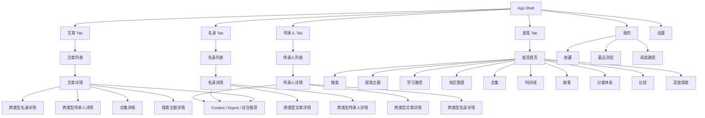
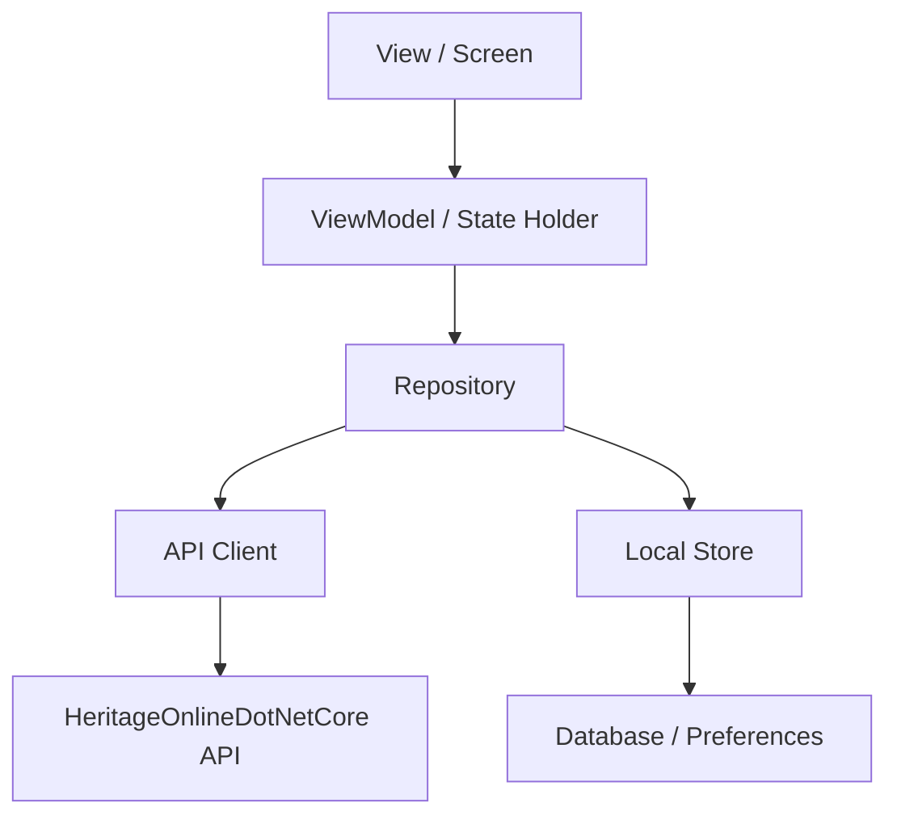
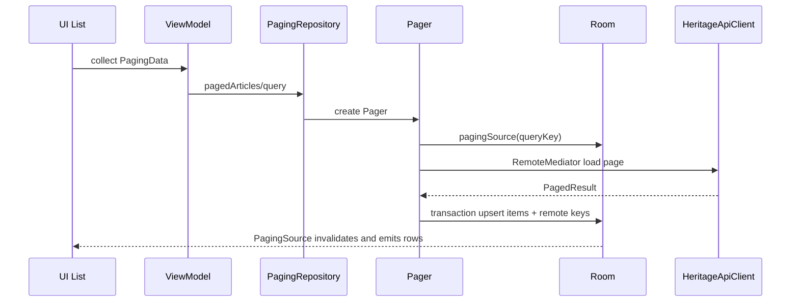

# Heritage Online 客户端跨平台实现规格

## 0. 文档定位

本文档用于指导 Heritage Online 的 iOS、macOS、Flutter 等新客户端实现。目标不是简单复刻 Android 代码，而是把当前 Android App 中已经验证过的产品结构、数据流、页面规则、本地能力和 UI 体验抽象成跨平台规格，让其他端可以按同一套标准实现，并尽量做到与 Android App 功能、交互、视觉和错误处理一致。

当前 Android 客户端是事实上的参考实现。其他端开发时，应优先遵循本文档中的功能分解、接口使用、状态管理、导航规则和 UI 样式要求；平台技术选型可以不同，但用户体验和业务语义应保持一致。

## 1. 当前 Android 参考实现概览

### 1.1 技术栈

Android 当前使用：

- Kotlin
- Jetpack Compose
- Material 3
- Navigation 3 风格的 typed back stack
- Hilt 依赖注入
- Ktor Client 网络请求
- kotlinx.serialization JSON 解析
- Room 本地数据库
- Paging 3 + RemoteMediator
- Coil 3 图片加载
- ZoomImage 图片预览
- DataStore 设置持久化
- JUnit / AndroidX Test / Compose UI Test

跨平台实现时不需要逐字复制技术栈，但需要保留同等职责边界：

- 网络层：统一 API client，负责 endpoint、query、path encode、JSON decode。
- Repository 层：对 ViewModel 暴露稳定业务方法，封装缓存策略。
- 本地存储层：收藏、最近浏览、阅读路径、分页缓存、详情缓存。
- ViewModel/State 层：把网络、本地数据和 UI 状态合并成可渲染状态。
- UI 层：纯展示和交互回调，不直接写数据库、不直接拼复杂 API。

### 1.2 当前技术选型和用途

本文档不直接提供 SwiftUI、Flutter 的迁移表。跨平台重构前，必须先理解当前 Android 端每个技术选择承担的职责，再在目标平台寻找同等职责的实现方式。

| 技术 | 当前用途 | 迁移时必须保留的能力 |
| --- | --- | --- |
| Kotlin | App 主语言，承载 DTO、Repository、ViewModel、UI 状态和业务逻辑 | 强类型模型、空值安全、可测试的业务函数 |
| Jetpack Compose | 所有页面 UI、共享组件、状态驱动渲染 | 声明式 UI、单向数据流、组合式组件复用 |
| Material 3 | 颜色、排版、组件语义、明暗主题基础 | 统一 design token、明暗模式、可访问性对比度 |
| Navigation 3 typed back stack | 四个主入口内部独立导航栈，详情页隐藏底栏 | 类型安全路由、二级页面 back stack、跨类型跳转 |
| Hilt | Application、Activity、ViewModel、Repository、Room、Ktor、ImageLoader 注入 | 集中依赖创建、测试可替换依赖、避免 UI 手写实例 |
| Ktor Client | HTTPS 请求、query/path 构造、JSON 解析、自签名证书调试 | API client 单一入口、路径编码、错误传播 |
| kotlinx.serialization | DTO 解码，和后端 JSON 合同保持一致 | 字段名稳定、枚举 wire value 稳定、未知字段容错 |
| Room | 列表分页缓存、详情缓存、首页 banner、收藏、最近浏览、阅读路径 | 离线可读、本地状态持久化、分页数据源 |
| Paging 3 + RemoteMediator | 文章、名录、传承人三类长列表分页 | 首屏、追加、刷新、错误重试、缓存一致性 |
| Coil 3 | 列表图、详情图、发现页图、占位图加载 | 图片缓存、HTTPS、自定义 loader、统一 URL 选择 |
| ZoomImage | 图片预览页缩放、拖拽、翻页体验 | 多图预览、手势缩放、沉浸层关闭 |
| DataStore | 主题模式、语言模式持久化 | 设置持久化、启动时恢复、系统跟随 |
| JUnit / AndroidX / Compose Test | DTO、Repository、ViewModel、Paging、Smoke 测试 | 合同测试、状态测试、UI smoke 基线 |

### 1.3 代码目录总览

当前 Android App 代码位于 `app/src/main/java/com/duckylife/heritage/modern`。目录职责如下。

| 目录 | 职责 | 迁移关注点 |
| --- | --- | --- |
| 根目录 | `HeritageModernApplication` 和 `MainActivity`，负责应用启动、主题语言、顶层导航 | 新平台要先搭出 App Shell、主题、四个主入口 |
| `core/network` | API client、请求 query、JSON 配置、DTO | 所有端必须严格对齐 API 合同 |
| `core/data` | Repository 接口和默认实现，封装网络、Room、分页、详情缓存 | UI 不直接访问 API 或数据库 |
| `core/database` | Room database、entity、dao、mapper、migration | 本地缓存与离线能力的核心 |
| `core/paging` | 三类列表的 RemoteMediator | 长列表分页策略参考 |
| `core/saved` | 收藏、最近浏览的 Repository 和 key 规则 | 我的页、详情收藏、最近浏览依赖它 |
| `core/settings` | 主题和语言设置枚举、DataStore 仓库 | 设置页和启动恢复依赖它 |
| `core/image` | 全局 Coil ImageLoader 获取 | 所有图片必须复用统一 loader |
| `di` | Hilt 模块，提供网络、数据库、Repository、图片加载器 | 目标平台也要有集中依赖容器 |
| `feature/articles` | 文章列表、文章导航、文章详情 | 首页式内容入口之一 |
| `feature/directory` | 名录列表、统计、名录详情、名录内部导航 | 非遗项目主业务入口 |
| `feature/inheritors` | 传承人列表、传承人详情、传承人内部导航 | 人物主业务入口 |
| `feature/discovery` | 发现页和发现内部导航，承载新版探索能力 | 新 API 的聚合入口 |
| `feature/search` | 全局搜索、建议、筛选、混合结果 | 发现页搜索框进入 |
| `feature/explore` | 探索主题详情 | 主题 chips 和详情页探索区进入 |
| `feature/learning` | 学习路径详情 | 发现页学习路径进入 |
| `feature/timeline` | 年份时间线 | 发现页时间线入口进入 |
| `feature/regions` | 地区图谱和地区详情 | 发现页地区图谱入口进入 |
| `feature/collections` | 合集详情和主题合集 | 发现页、详情页合集进入 |
| `feature/stories` | 数据故事首页和故事详情 | 发现页数据故事入口进入 |
| `feature/taxonomy` | 主题库首页和主题详情 | 发现页主题库入口进入 |
| `feature/compare` | 地区、分类、种类对比 | 主题库详情、发现功能入口进入 |
| `feature/detail` | 三类详情页共用的探索跳转和阅读路径记录 | 详情页底部增强能力 |
| `feature/my` | 我的页、收藏、最近浏览、阅读路径 | 隐藏入口，不占底部导航 |
| `feature/settings` | 设置页 | 主题、语言、我的页入口 |
| `ui/component` | 共享视觉组件 | 跨页面一致性基线 |
| `ui/error` | 错误分类与文案映射 | 网络错误、超时、未知错误统一展示 |
| `ui/preview` | 图片预览 URL 选择和 overlay | 详情图库和正文图片依赖 |
| `ui/text` | wire value 本地化显示 | 禁止直接显示后端原始枚举 |
| `ui/theme` | Material 3 色板、字体、圆角 | 所有页面样式的根 token |

### 1.4 关键文件职责清单

根文件：

| 文件 | 作用 |
| --- | --- |
| `HeritageModernApplication.kt` | Hilt Application 入口。仅负责让 Hilt 接管依赖图。 |
| `MainActivity.kt` | App Shell。读取主题/语言设置，应用系统栏样式，配置四个底部导航入口，管理设置页和我的页隐藏入口，并把 pending navigation 分发到对应 tab。 |
| `SuspendRunCatching.kt` | 对 suspend 调用做 `runCatching` 风格包装，方便 ViewModel 统一处理异常。 |

网络层：

| 文件 | 作用 |
| --- | --- |
| `HeritageApiConfig.kt` | 保存 API baseUrl 和是否信任自签名证书。值来自 BuildConfig。 |
| `HeritageJson.kt` | 全局 JSON 配置。应允许未知字段，避免后端加字段导致客户端崩溃。 |
| `HeritageQueries.kt` | 所有查询参数模型，例如文章、名录、搜索、时间线、发现深挖、综合推荐。 |
| `HeritageApiClient.kt` | API client 接口和 Ktor 实现。负责 endpoint 拼接、query 参数、path segment 编码、HTTPS client 和 DTO 解析。 |
| `dto/CommonDtos.kt` | 通用分页、媒体资源、ProblemDetails、facet、topic link。 |
| `dto/ContentDtos.kt` | 文章、名录、传承人、统计等主内容 DTO。 |
| `dto/SearchDtos.kt` | Search v2 响应、facets、suggestion、混合搜索结果。 |
| `dto/TimelineDtos.kt` | 时间线条目、年份 bucket、facet。 |
| `dto/ExploreDtos.kt` | 探索首页、主题、学习路径相关 DTO。 |
| `dto/RegionDtos.kt` | 地区图谱、地区详情统计、featured content。 |
| `dto/CollectionDtos.kt` | 精选合集、合集详情、合集 item。 |
| `dto/ContextDtos.kt` | 详情 context：相关、推荐、语义推荐、合集、主题、图谱。 |
| `dto/DigestDtos.kt` | 内容 digest 速览。 |
| `dto/RecommendationDtos.kt` | 综合推荐响应和得分拆分。 |
| `dto/DiscoveryDtos.kt` | 今日发现、随机、趋势、本周、深挖。 |
| `dto/StoryDtos.kt` | 数据故事。 |
| `dto/TaxonomyDtos.kt` | 主题库、分类/地区详情。 |
| `dto/CompareDtos.kt` | 对比结果。 |

数据层：

| 文件 | 作用 |
| --- | --- |
| `HeritageRepository.kt` | App 业务数据门面。列表、详情、搜索、发现、统计、故事、主题库、对比、推荐都从这里暴露。 |
| `ArticlePagingRepository.kt` | 文章 Paging 入口，组合 Pager、Room pagingSource、ArticleRemoteMediator。 |
| `DirectoryPagingRepository.kt` | 名录 Paging 入口。 |
| `InheritorPagingRepository.kt` | 传承人 Paging 入口。 |
| `ReadingPathRepository.kt` | 阅读路径事件模型和 Room 仓库。记录 from -> to 的跨内容跳转。 |

数据库层：

| 文件/目录 | 作用 |
| --- | --- |
| `HeritageDatabase.kt` | Room database 注册所有 entity 和 dao，当前版本为 10，导出 schema。 |
| `HeritageMigrations.kt` | 数据库版本迁移。任何 entity 变更都必须在这里加 migration。 |
| `entity/*Entity.kt` | Room 表结构。列表、详情、remote key、banner、收藏、阅读路径都在这里定义。 |
| `dao/*Dao.kt` | Room 查询、观察、插入、删除、清理接口。 |
| `mapper/*Mapper.kt` | DTO 与 Entity 转换，保证网络模型和数据库模型解耦。 |

UI 层：

| 文件/目录 | 作用 |
| --- | --- |
| `ui/theme/Theme.kt` | 全局 Material 3 颜色、字体和圆角。 |
| `ui/component/HeritageSurface.kt` | 页面背景、页面头、区块标题、卡片、chip、图片占位、列表卡、事实卡、引用卡、筛选按钮。 |
| `ui/component/HeritageSearchField.kt` | 统一搜索输入框。 |
| `ui/component/DiscoveryItemCard.kt` | 发现页和其他混合内容列表的统一 item 卡/行。 |
| `ui/component/DetailExploreSection.kt` | 三类详情页底部探索总容器。 |
| `ui/component/DetailContextSection.kt` | context 的相关、推荐、合集、主题、图谱展示。 |
| `ui/component/DigestCard.kt` | 内容 digest 速览卡。 |
| `ui/component/BlendedRecommendationCard.kt` | 综合推荐卡和得分条。 |
| `ui/component/MetricPill.kt` | 统计指标 pill。 |
| `ui/error/ErrorMessage.kt` | 把 Throwable 映射成 `ErrorKind`，再映射到本地化文案。 |
| `ui/preview/ImagePreviewOverlay.kt` | 图片预览蒙层。 |
| `ui/preview/ImagePreviewUrl.kt` / `ImagePreviewUrls.kt` | 按 display/original/thumbnail 选择预览 URL。 |
| `ui/text/ContentLabels.kt` | 内容类型、文章分类、名录 kind、阅读路径来源本地化。 |

### 1.5 构建配置和运行环境

Gradle 和 Android 配置位于 `app/build.gradle.kts` 与 `gradle/libs.versions.toml`。

构建参数：

- `namespace`：`com.duckylife.heritage.modern`
- `applicationId`：`com.duckylife.heritage.modern`
- `minSdk`：26
- `targetSdk`：36
- `compileSdk`：36
- `versionName`：`0.1.0`
- `versionCode`：1
- Compose：开启
- BuildConfig：开启
- Room schema：导出到 `app/schemas`

API baseUrl：

- Gradle property：`heritageApiBaseUrl`
- 默认值：`https://10.0.2.2:5078`
- 用途：Android 模拟器访问宿主机 HTTPS 后端。

自签名证书：

- Gradle property：`heritageTrustSelfSigned`
- debug 默认 `true`
- release 默认 `false`
- Ktor/OkHttp 仅在配置允许时信任自签名证书。

release 签名：

- `heritageReleaseStoreFile`
- `heritageReleaseStorePassword`
- `heritageReleaseKeyAlias`
- `heritageReleaseKeyPassword`
- `validateReleaseSigning` 只在 release packaging 前校验，避免 debug 构建被 keystore 阻塞。

本地验证任务：

```bash
cd /Users/kaisun/Documents/Github/heritage-online-android/modern-android
./gradlew :app:testDebugUnitTest :app:assembleDebug
./gradlew :app:verifyLocal
```

依赖版本基线：

| 依赖 | 当前版本 | 作用 |
| --- | --- | --- |
| Android Gradle Plugin | 9.2.1 | Android 构建 |
| Kotlin | 2.3.21 | Kotlin 编译和插件 |
| Compose BOM | 2026.05.00 | Compose 组件版本对齐 |
| Activity Compose | 1.13.0 | Activity setContent |
| Lifecycle | 2.10.0 | collectAsStateWithLifecycle、ViewModel |
| Navigation 3 | 1.1.1 | typed back stack |
| Hilt | 2.59.2 | 依赖注入 |
| Ktor | 3.4.3 | HTTP client |
| kotlinx.serialization | 1.11.0 | JSON |
| Coroutines | 1.11.0 | 异步和 Flow |
| Coil | 3.2.0 | 图片加载 |
| ZoomImage | 1.4.0 | 图片缩放预览 |
| Room | 2.8.4 | SQLite ORM |
| Paging | 3.5.0 | 分页 |
| Espresso | 3.7.0 | instrumentation 基础 |

### 1.6 运行时启动流程

启动顺序：

1. Android 创建 `HeritageModernApplication`，Hilt 初始化应用级依赖图。
2. `MainActivity.onCreate` 进入 Compose `setContent`。
3. 从 `ThemeSettingsRepository` 的 DataStore Flow 读取 `themeMode` 和 `languageMode`。
4. `LaunchedEffect(languageMode)` 调用 `applyLanguageMode`。
5. `SideEffect` 根据当前主题调用 `enableEdgeToEdge`，同步状态栏/导航栏图标颜色。
6. `HeritageTheme` 包裹整个 App，注入 Material 3 colorScheme、typography、shapes。
7. `HeritageApp` 渲染 Scaffold、底部导航、设置页、我的页和四个主 tab 内部 NavHost。

语言切换规则：

- Android 13+ 使用 `LocaleManager.applicationLocales`。
- Android 13 以下直接更新 `resources.configuration`。
- 不替换 Compose `LocalContext`，因为 Hilt ViewModel 需要真实 Activity context。
- 初次启动必须等待 DataStore 返回真实语言设置后再应用，避免先 System 后保存值造成 Activity 连续重启。

主题切换规则：

- `System` 跟随 `isSystemInDarkTheme()`。
- `Light` 强制浅色。
- `Dark` 强制暗色。
- 系统栏使用透明背景，并根据主题设置 light/dark system bar style。


## 2. 产品信息架构

### 2.1 顶层结构

App 顶层由底部导航和两个隐藏入口组成。

底部导航有 4 个主入口：

1. 文章
2. 名录
3. 传承人
4. 发现

隐藏入口：

- 我的：从顶栏图标进入，不占底部导航。
- 设置：从顶栏或我的页入口进入，不占底部导航。

底部导航显示规则：

- 主列表页显示底部导航。
- 详情页、搜索页、合集页、探索页、时间线、地区图谱等二级页面隐藏底部导航。
- 我的页和设置页隐藏底部导航。
- 从我的页点击收藏、最近浏览、阅读路径进入内容详情时，应切换到对应主 tab，并推入详情页。

### 2.2 页面地图



## 3. 全局架构规格

### 3.1 推荐分层

所有平台都应保持以下分层：



职责要求：

- UI 只负责渲染、用户输入、点击回调、局部动画。
- ViewModel 负责加载、刷新、分页、状态合并、错误转换。
- Repository 负责调用 API、读写缓存、处理 lookup 优先级。
- API Client 负责 endpoint 和 DTO，不包含 UI 逻辑。
- Local Store 负责收藏、最近浏览、阅读路径、分页缓存、设置。

### 3.2 状态模型

所有页面至少支持 4 种状态：

- Loading：首次加载或刷新中。
- Success：有可展示数据。
- Empty：请求成功但没有数据。
- Error：请求失败，保留 retry。

详情页还应支持“主体成功但附加区块失败”：

- 详情正文加载失败：显示整页错误。
- Context / Digest / 综合推荐加载失败：只在对应区块显示错误，不影响正文。
- 图片加载失败：显示占位，不阻断页面。

### 3.3 错误语义

客户端不要直接展示原始异常堆栈。应转换为有限错误类型：

- Network：网络不可用、连接失败。
- NotFound：404 或资源不存在。
- Validation：400 参数错误。
- Server：5xx 后端错误。
- Unknown：其他错误。

UI 文案必须本地化。详细错误可在 debug build 或日志中保留。

## 4. API Client 规格

### 4.1 基础配置

开发环境 Android 当前通过模拟器访问：

```text
https://10.0.2.2:5078
```

iOS 模拟器通常使用：

```text
https://localhost:5078
```

真机调试使用局域网 IP，例如：

```text
https://192.168.x.x:5078
```

所有平台都应支持环境配置：

- Debug base URL
- Release base URL
- 是否允许自签名证书，仅 debug 可开启
- 请求超时
- JSON 宽松解析策略

### 4.2 URL 编码规则

所有 path segment 必须安全编码，特别是：

- 中文地区名
- 中文分类名
- 年份或 kind
- topic key
- collection id

不要直接字符串拼接未编码的中文 path。

### 4.3 核心 API 列表

#### 首页

| 功能 | Method | Path |
| --- | --- | --- |
| 首页 Banner | GET | `/api/home-banners` |
| 首页 Feed | GET | `/api/home/feed` |

#### 文章

| 功能 | Method | Path |
| --- | --- | --- |
| 文章列表 | GET | `/api/articles` |
| 文章详情 by id | GET | `/api/articles/{id}` |
| 文章详情 by sourceId | GET | `/api/articles/source/{sourceId}?category={category}` |
| 文章详情 by sourceUrl | GET | `/api/articles/source?url={sourceUrl}&category={category}` |
| 文章 Context | GET | `/api/articles/{id}/context` |
| 文章 Digest | GET | `/api/articles/{id}/digest` |

文章列表参数：

- `category`
- `page`
- `pageSize`
- `keywords`
- `hasImage`

文章分类：

- `news`
- `forum`
- `specialTopic`

#### 名录

| 功能 | Method | Path |
| --- | --- | --- |
| 名录列表 | GET | `/api/directory-items` |
| 名录详情 by id | GET | `/api/directory-items/{id}` |
| 名录详情 by sourceId | GET | `/api/directory-items/source/{sourceId}?kind={kind}` |
| 名录 Context | GET | `/api/directory-items/{id}/context` |
| 名录 Digest | GET | `/api/directory-items/{id}/digest` |
| 名录统计总览 | GET | `/api/directory-items/statistics?kind={kind}` |
| 名录统计 breakdown | GET | `/api/directory-items/statistics/breakdown?kind={kind}&dimension={dimension}&limit={limit}` |

名录 kind：

- `nationalProject`
- `culturalEcoZone`
- `productiveProtectionBase`
- `unescoEntry`
- `chinaUnescoEntry`
- `contractingState`

统计 dimension：

- `publishedYear`
- `category`
- `region`
- `batch`
- `listType`
- `nominationType`
- `protectionUnit`

#### 传承人

| 功能 | Method | Path |
| --- | --- | --- |
| 传承人列表 | GET | `/api/inheritors` |
| 传承人详情 by id | GET | `/api/inheritors/{id}` |
| 传承人详情 by sourceId | GET | `/api/inheritors/source/{sourceId}` |
| 传承人 Context | GET | `/api/inheritors/{id}/context` |
| 传承人 Digest | GET | `/api/inheritors/{id}/digest` |

传承人列表参数：

- `page`
- `pageSize`
- `keywords`
- `region`
- `category`
- `year`
- `gender`
- `hasImage`

#### 搜索

| 功能 | Method | Path |
| --- | --- | --- |
| 搜索 v2 | GET | `/api/search/v2` |
| 搜索建议 | GET | `/api/search/suggestions` |

搜索参数：

- `query`
- `types`
- `region`
- `category`
- `year`
- `kind`
- `hasImage`
- `page`
- `pageSize`

搜索结果类型：

- `article`
- `directoryItem`
- `inheritor`

#### 时间线

| 功能 | Method | Path |
| --- | --- | --- |
| 时间线 | GET | `/api/timeline/v2` |
| 年份聚合 | GET | `/api/timeline/years` |

时间线参数：

- `year`
- `types`
- `region`
- `category`
- `kind`
- `hasImage`
- `page`
- `pageSize`

#### 探索

| 功能 | Method | Path |
| --- | --- | --- |
| 探索首页 | GET | `/api/explore` |
| 探索主题列表 | GET | `/api/explore/topics` |
| 探索主题详情 | GET | `/api/explore/topics/{type}/{key}` |
| 学习路径列表 | GET | `/api/explore/learning-paths` |
| 学习路径详情 | GET | `/api/explore/learning-paths/{id}` |

探索主题 type：

- `region`
- `category`
- `year`
- `kind`

#### 地区图谱

| 功能 | Method | Path |
| --- | --- | --- |
| 地区图谱首页 | GET | `/api/regions/atlas` |
| 地区图谱详情 | GET | `/api/regions/{region}/atlas` |

#### 合集

| 功能 | Method | Path |
| --- | --- | --- |
| 精选合集 | GET | `/api/collections/featured` |
| 合集详情 | GET | `/api/collections/{id}` |
| 主题合集 | GET | `/api/collections/topic/{type}/{key}` |

常见合集 id：

- `latest-news`
- `latest-special-topics`
- `recent-forum`
- `national-projects`
- `featured-inheritors`
- `with-images`
- `latest-all`
- `recommended-articles`
- `recommended-directory-items`
- `recommended-inheritors`
- `image-gallery`

#### 发现增强

| 功能 | Method | Path |
| --- | --- | --- |
| 今日发现 | GET | `/api/discovery/today` |
| 随机内容 | GET | `/api/discovery/random?type={type}` |
| 趋势内容 | GET | `/api/discovery/trending` |
| 本周精选 | GET | `/api/discovery/weekly` |
| 偶遇内容 | GET | `/api/discovery/serendipity` |
| 深度探索 | GET | `/api/discovery/deep-dive` |

#### 数据故事

| 功能 | Method | Path |
| --- | --- | --- |
| 地区故事 | GET | `/api/stories/regions/{region}` |
| 分类故事 | GET | `/api/stories/categories/{category}` |
| 年份故事 | GET | `/api/stories/years/{year}` |

#### 分类体系

| 功能 | Method | Path |
| --- | --- | --- |
| 分类索引 | GET | `/api/taxonomy/categories` |
| 地区索引 | GET | `/api/taxonomy/regions` |
| kind 索引 | GET | `/api/taxonomy/kinds` |
| 分类详情 | GET | `/api/taxonomy/category/{category}` |
| 地区详情 | GET | `/api/taxonomy/region/{region}` |

#### 比较

| 功能 | Method | Path |
| --- | --- | --- |
| 地区比较 | GET | `/api/compare/regions` |
| 分类比较 | GET | `/api/compare/categories` |
| kind 比较 | GET | `/api/compare/kinds` |

#### 推荐

| 功能 | Method | Path |
| --- | --- | --- |
| 综合推荐 | GET | `/api/recommendations/blended/{type}/{id}` |

综合推荐参数：

- `limit`
- `ruleWeight`
- `semanticWeight`
- `sameCategoryWeight`
- `sameRegionWeight`
- `diversify`

### 4.4 DTO 命名和字段策略

跨平台 DTO 应以 API 合同为准，不要按页面临时命名。建议命名：

- `ArticleSummary`
- `ArticleDetail`
- `DirectoryItemSummary`
- `DirectoryItemDetail`
- `InheritorSummary`
- `InheritorDetail`
- `MediaAsset`
- `PagedResult<T>`
- `DetailContext`
- `ContentDigest`
- `BlendedRecommendationResponse`
- `DiscoveryItem`
- `ExploreTopic`
- `LearningPath`
- `RegionAtlas`
- `Collection`
- `TimelineItem`
- `TaxonomyTopic`
- `CompareResult`

字段解析要求：

- 字段缺失时给合理默认值。
- 列表默认空数组。
- 可选字符串允许 null。
- enum 解析要能处理未知值，避免后端新增值导致客户端崩溃。
- 日期先按字符串展示或局部格式化，不要在 DTO 层强制转日期对象导致解析失败。

## 5. 数据层和缓存策略

### 5.1 Repository 规格

Repository 应暴露平台无关的业务方法：

- `articles(query)`
- `pagedArticles(query)`
- `article(id)`
- `articleBySourceId(sourceId, category)`
- `articleBySourceUrl(sourceUrl, category)`
- `refreshArticleDetail(lookup)`
- `articleContext(id)`
- `directoryItems(query)`
- `pagedDirectoryItems(query)`
- `directoryItem(id)`
- `directoryItemBySourceId(sourceId, kind)`
- `refreshDirectoryDetail(lookup)`
- `directoryItemContext(id)`
- `inheritors(query)`
- `pagedInheritors(query)`
- `inheritor(id)`
- `inheritorBySourceId(sourceId)`
- `refreshInheritorDetail(lookup)`
- `inheritorContext(id)`
- `searchV2(query)`
- `timelineV2(query)`
- `exploreIndex()`
- `learningPaths()`
- `regionAtlas()`
- `featuredCollections()`
- `collection(id)`
- `discoveryToday()`
- `taxonomyCategories()`
- `compareRegions(left, right)`
- `articleDigest(id)`
- `blendedRecommendations(type, id)`

### 5.2 详情 lookup 优先级

详情页有三种打开方式：

- by internal id
- by sourceId
- by sourceUrl，仅文章支持

优先级：

1. 如果有 internal id，优先使用 id。
2. 如果没有 id 但有 sourceId，使用 sourceId API。
3. 如果文章没有 id/sourceId 但有 sourceUrl，使用 sourceUrl API。
4. 如果所有 key 都缺失，页面应显示错误，不应发空请求。

阅读路径回跳有特殊规则：

- 如果事件有 `toSourceId` 或 `toSourceUrl`，不要把 `toId` 当 internal id 使用。
- 这可以避免把来源站点 id 错误传给 internal id endpoint。

### 5.3 本地数据库

Android 当前本地数据包括：

- Article list cache
- Article detail cache
- Directory list cache
- Directory detail cache
- Inheritor list cache
- Inheritor detail cache
- Paging remote keys
- Home banners
- Saved content
- Reading path events

其他平台可以按阶段实现：

第一阶段必须实现：

- 收藏
- 最近浏览
- 阅读路径
- 设置

第二阶段建议实现：

- 详情缓存
- 图片缓存，通常由图片库负责

第三阶段再实现：

- 列表分页缓存
- Remote key 等离线分页能力

### 5.4 SavedContent 规格

SavedContent 同时服务收藏和最近浏览。

核心字段：

- `contentType`: article / directoryItem / inheritor
- `title`
- `subtitle`
- `summary`
- `imageUrl`
- `targetId`
- `targetSourceId`
- `targetSourceUrl`
- `category`
- `kind`
- `isFavorite`
- `viewedAt`
- `favoritedAt`

key 计算规则：

1. 优先 target id。
2. 其次 sourceUrl。
3. 再其次 sourceId。

最近浏览：

- 详情页成功加载后记录。
- 重复内容更新 viewedAt。
- 最近浏览列表按 viewedAt 倒序。

收藏：

- 详情页顶部提供收藏按钮。
- 收藏状态应从本地数据库观察。
- 收藏不依赖网络成功写入后端。

### 5.5 ReadingPath 规格

阅读路径记录“从一个内容继续探索到另一个内容”。

核心字段：

- `id`
- `fromType`
- `fromId`
- `fromTitle`
- `toType`
- `toId`
- `toTitle`
- `source`
- `toCategory`
- `toKind`
- `toSourceId`
- `toSourceUrl`
- `toSubtitle`
- `toImageUrl`
- `createdAt`

source 枚举：

- `blendedRecommendation`
- `related`
- `recommendation`
- `semanticRecommendation`
- `graph`
- `list`

当前不记录：

- `collection`
- `topic`

原因：

- 我的页当前只支持回跳文章、名录、传承人。

稳定 id 规则：

```text
{fromType}:{fromId}->{toType}:{toId}:{source}
```

同一路径再次发生时更新 createdAt，而不是重复增加多条。

回跳规则：

- `article`：如果有 `toSourceId` 或 `toSourceUrl`，articleId 置空，走 source lookup。
- `directoryItem`：如果有 `toSourceId`，itemId 置空，走 source lookup。
- `inheritor`：如果有 `toSourceId`，inheritorId 置空，走 source lookup。
- 不支持类型返回 null，不跳转。

### 5.6 Paging 和缓存数据流

文章、名录、传承人三类主列表使用同一套分页思想。

数据流：



queryKey：

- 每种列表都把当前查询条件拼成稳定字符串。
- Room entity 保存 queryKey，避免不同筛选结果混在一起。
- 切换搜索/筛选/kind 时，会生成新的 queryKey 和新的 PagingData。

RemoteMediator 职责：

- `REFRESH`：请求第一页，清理当前 queryKey 下旧数据和 remote key。
- `APPEND`：根据 remote key 请求下一页。
- `PREPEND`：通常直接返回 endOfPaginationReached。
- 写入 Room 必须在 transaction 内完成。
- 后端 `hasMore=false` 时停止追加。

UI LoadState 规则：

- `refresh is Loading` 且列表为空：显示首屏 loading。
- `refresh is Error` 且列表为空：显示全页错误。
- `append is Loading`：底部 loading。
- `append is Error`：底部 retry。
- itemCount 为 0 且 refresh 完成：显示 empty。

### 5.7 ViewModel 和 UiState 规范

每个 feature 都遵循“Route 收集状态、Screen 纯展示、ViewModel 管理业务”的结构。

文件组合：

- `XxxRoute`：从 Hilt/Assisted Hilt 获取 ViewModel，收集 StateFlow，组装回调。
- `XxxScreen`：接收 UiState 和事件 lambda，不直接依赖 Repository。
- `XxxUiState`：页面状态的单一数据对象。
- `XxxViewModel`：发起数据请求、保存筛选、处理重试、合成 UiState。

StateFlow 规则：

- ViewModel 私有 `_uiState = MutableStateFlow(...)`。
- 对外暴露 `val uiState: StateFlow<XxxUiState> = _uiState.asStateFlow()`。
- Compose 使用 `collectAsStateWithLifecycle()`，避免页面不可见时继续无意义收集。

常用状态字段：

- `isLoading`
- `errorKind`
- `items` 或 `detail`
- `selectedType/selectedTab/selectedYear`
- `searchKeywords`
- `activeFilterCount`
- `hasMore`
- `isLoadingMore`

请求错误处理：

- ViewModel 捕获 Throwable 后转换为 `ErrorKind`。
- UI 只根据 `ErrorKind` 显示本地化文案。
- 不把后端 ProblemDetails 原文直接展示给普通用户。

筛选状态：

- 文章、名录、传承人列表使用 `SavedStateHandle` 保存关键词、筛选、tab。
- 搜索输入防抖：
  - 主列表：350ms。
  - 搜索建议：200ms。
- 切换筛选后应触发新的 query，不应手动修改 PagingData 内部数据。

详情 ViewModel：

- 初始化时同时观察本地缓存和收藏状态。
- 随后刷新网络详情，刷新成功写入 Room。
- 详情正文、context、digest、blended recommendation 分别加载，附加区块失败不能覆盖正文。
- 成功拿到详情 snapshot 后记录最近浏览。

### 5.8 依赖注入模块

Hilt 模块位于 `di`。

| 文件 | 提供内容 | 说明 |
| --- | --- | --- |
| `NetworkModule.kt` | `HeritageApiConfig`、`HeritageApiClient` | baseUrl 和自签名配置集中创建 |
| `DatabaseModule.kt` | `HeritageDatabase` 和 DAO | Room singleton |
| `DataModule.kt` | `HeritageRepository`、`SavedContentRepository`、`ReadingPathRepository` | Repository 接口绑定到实现 |
| `ImageModule.kt` | Coil `ImageLoader` | 全局图片 loader，支持 Hilt EntryPoint 获取 |

迁移要求：

- UI 层不能直接 new API client。
- ViewModel 只依赖 Repository。
- Repository 可以依赖 API client 和 Database。
- 图片组件使用统一 ImageLoader。
- 测试必须能替换 Repository/API client。

## 6. 导航规格

### 6.1 Typed Route

所有平台都应使用强类型 route，不要只用字符串路由。

文章 tab route：

- `ArticlesList`
- `ArticleDetail(id, sourceId, sourceUrl, category)`
- `ArticleTabDirectoryDetail(id, sourceId, kind)`
- `ArticleTabInheritorDetail(id, sourceId)`
- `ArticleTabCollectionDetail(id)`
- `ArticleTabTopicDetail(type, key)`

名录 tab route：

- `DirectoryList`
- `DirectoryDetail(id, sourceId, kind)`
- `DirectoryInheritorDetail(id, sourceId)`
- `DirectoryTabArticleDetail(id, sourceId, sourceUrl, category)`
- `DirectoryTabCollectionDetail(id)`
- `DirectoryTabTopicDetail(type, key)`

传承人 tab route：

- `InheritorsList`
- `InheritorDetail(id, sourceId)`
- `InheritorDirectoryDetail(id, sourceId, kind)`
- `InheritorTabArticleDetail(id, sourceId, sourceUrl, category)`
- `InheritorTabCollectionDetail(id)`
- `InheritorTabTopicDetail(type, key)`

发现 tab route：

- `DiscoveryIndex`
- `SearchResults(query)`
- `ExploreTopicDetail(type, key)`
- `LearningPathDetail(id)`
- `RegionAtlasPage`
- `RegionAtlasDetail(region)`
- `TimelinePage`
- `CollectionDetail(id, type, topicKey)`
- `DiscoveryArticleDetail(id, sourceId, sourceUrl, category)`
- `DiscoveryDirectoryDetail(id, sourceId, kind)`
- `DiscoveryInheritorDetail(id, sourceId)`
- `StoryDetail(type, key)`
- `TaxonomyIndex`
- `TaxonomyDetail(type, key)`
- `Compare(type, left, right)`
- `DeepDive(seedType, seedId)`

### 6.2 Back Stack 持久化

每个 tab 应持有独立 back stack。

要求：

- tab 切换时保留该 tab 的当前页面。
- 进详情后隐藏底部导航。
- 返回到该 tab 根页面后显示底部导航。
- App 重建时尽量恢复当前 tab 和 back stack。
- route state 必须可以序列化或持久化。
- 每个 route key 必须能表达当前页面恢复需要的最小参数，例如 id/sourceId/sourceUrl/category/kind。

### 6.3 跨类型跳转

详情页 Context / 推荐 / 图谱 / 相关内容可以跳到不同内容类型。

规则：

- 点击 article：进入当前 tab 内的文章详情 route。
- 点击 directoryItem：进入当前 tab 内的名录详情 route。
- 点击 inheritor：进入当前 tab 内的传承人详情 route。
- 点击 collection：进入合集详情。
- 点击 topic：进入探索主题详情。

跨类型跳转要记录阅读路径，collection/topic 当前不记录。

## 7. 页面功能规格

### 7.1 文章列表

功能：

- 分页加载文章。
- 支持分类 tab：新闻、论坛、专题。
- 支持关键词搜索。
- 支持筛选。
- 列表 item 点击进入文章详情。
- 图片缺失时显示占位。

状态：

- 首屏 loading。
- 空列表 empty。
- 网络失败 error + retry。
- 分页 append loading/error。

UI：

- 顶部标题和操作区。
- 分类使用 tab/chip。
- 列表卡片信息包括：分类、标题、摘要、发布时间、图片。

### 7.2 文章详情

功能：

- 展示标题、摘要、发布时间、来源、作者、正文 block。
- 支持封面和正文图片预览。
- 支持收藏。
- 记录最近浏览。
- 展示相关文章。
- 展示 Digest。
- 展示综合推荐。
- 展示 Context。
- 记录阅读路径。

详情区块顺序：

1. Hero / 标题
2. Meta chips
3. Summary
4. Cover image
5. Body blocks
6. Related articles
7. DetailExploreSection

### 7.3 名录列表

功能：

- 分页加载名录。
- 支持 kind。
- 支持关键词、地区、分类、年份筛选。
- 支持统计入口。
- 点击进入名录详情。

UI：

- 名录卡片包含标题、kind、分类、地区、年份、图片。
- 筛选用 bottom sheet 或专门筛选面板。

### 7.4 名录详情

功能：

- 展示项目名称、kind、分类、地区、批次、保护单位等事实信息。
- 展示正文、图片、图集。
- 支持收藏。
- 记录最近浏览。
- 支持相关项目、相关传承人。
- 展示 Digest、综合推荐、Context。
- 记录阅读路径。

### 7.5 传承人列表

功能：

- 分页加载传承人。
- 支持关键词、地区、分类、年份、性别筛选。
- 点击进入传承人详情。

UI：

- 传承人卡片包含姓名、性别、民族、项目、分类、地区、图片或占位。

### 7.6 传承人详情

功能：

- 展示姓名、性别、民族、项目、分类、地区、批次。
- 展示人物简介、正文、图片。
- 支持收藏。
- 记录最近浏览。
- 支持相关项目、相关传承人。
- 展示 Digest、综合推荐、Context。
- 记录阅读路径。

### 7.7 发现首页

发现页是新版 API 的聚合入口，不是普通列表页。

首屏模块：

- 搜索框
- 今日发现
- 趋势内容
- 本周精选
- 学习路径
- 精选合集
- 地区图谱入口
- 时间线入口
- 分类体系入口
- 比较入口
- 深度探索入口

UI 要求：

- 不做营销 hero。
- 信息密度适中。
- 横向卡片和纵向入口结合。
- 每个模块都应有 loading/empty/error 处理。

### 7.8 搜索页

功能：

- 输入前显示建议。
- 输入后请求 search v2。
- 支持 type、region、category、year、kind、hasImage 筛选。
- 混合结果点击进入对应详情。

交互：

- 空关键词不请求 search。
- debounce 输入。
- 点击 suggestion 填入并搜索。

### 7.9 探索主题

功能：

- 展示主题标题、副标题、统计、sections。
- sections 内混合内容可以跳文章、名录、传承人。
- 底部展示 timeline 和 related topics。

### 7.10 学习路径

功能：

- 列表展示学习路线卡片。
- 详情展示 title、subtitle、tags、steps、featuredItems、relatedTopics。
- steps 用纵向 stepper 风格。

### 7.11 时间线

功能：

- 展示年份 selector。
- 支持类型筛选。
- 按时间线形式展示内容。
- 支持加载更多。

UI：

- 左侧时间点，右侧内容卡片。
- 不使用普通列表堆砌。

### 7.12 地区图谱

功能：

- 地区图谱首页展示地区卡片网格。
- 地区详情展示总览、类别 breakdown、kind breakdown、featured directory、featured inheritors、related articles、timeline、related regions。

UI：

- 不做复杂地图。
- 用排行榜、进度条、chips、统计卡片表达。

### 7.13 合集

功能：

- 精选合集入口。
- 合集详情展示 title、subtitle、type、tags、generatedAt。
- items 是混合内容，按 type 跳详情。

### 7.14 数据故事

功能：

- 地区、分类、年份故事。
- 展示故事标题、说明、统计、相关内容、图片。

适合放在发现页和主题详情中作为沉浸式阅读入口。

### 7.15 分类体系

功能：

- 分类索引、地区索引、kind 索引。
- 分类详情和地区详情。

用途：

- 更系统地浏览非遗主题。
- 可作为发现页中的结构化入口。

### 7.16 比较

功能：

- 比较两个地区。
- 比较两个分类。
- 比较两个 kind。

UI：

- 输入/选择两个对象。
- 展示总览、差异、共同点、代表内容。
- 不做复杂图表，优先卡片、chips、条形对比。

### 7.17 我的页

Tabs：

1. 收藏
2. 最近浏览
3. 阅读路径

收藏：

- 按收藏时间倒序。
- 点击回跳详情。
- 可取消收藏。

最近浏览：

- 按 viewedAt 倒序。
- 点击回跳详情。
- 可删除单条或清空。

阅读路径：

- 展示目标内容类型、来源、目标标题。
- 点击回跳目标详情。
- 支持清空。
- 当前只支持文章、名录、传承人。

### 7.18 设置页

功能：

- 主题：跟随系统、浅色、暗色。
- 语言：跟随系统、中文、英文。

要求：

- 设置持久化。
- 切换语言不闪退。
- 切换主题后所有页面颜色正确。
- 设置页入口隐蔽但可达。

## 8. DetailExploreSection 规格

详情页底部统一使用 DetailExploreSection。

顺序：

1. Digest
2. 综合推荐
3. Related
4. Recommendations
5. Semantic Recommendations
6. Collections
7. Explore Topics
8. Graph

显示规则：

- 所有区块都没有数据、loading、error 时，整个探索区隐藏。
- Digest 失败只显示 Digest 错误。
- Context 失败只显示 Context 错误。
- 综合推荐无有效 item 时不显示综合推荐。

点击规则：

- 推荐 item 要携带 id、type、title、category、kind、sourceId、sourceUrl、imageUrl。
- 点击后先异步记录阅读路径，再立即导航。
- collection/topic 可导航，但当前不记录阅读路径。

## 9. 图片与预览规格

### 9.1 图片 URL 选择

MediaAsset 统一按优先级取图：

1. `displayUrl`
2. `thumbnailUrl`
3. `originalUrl`
4. `sourceUrl`

预览大图优先：

1. `originalUrl`
2. `displayUrl`
3. `sourceUrl`
4. `thumbnailUrl`

### 9.2 图片占位

无图：

- 使用 `surfaceContainerHighest` 或等价 token。
- 中间显示标题首字。
- 不使用突兀的高饱和色。

加载失败：

- 保留占位。
- 不显示技术错误。

### 9.3 图片预览

要求：

- 支持封面、图集、正文图片。
- 支持左右切换。
- 支持双指缩放。
- 支持单击或按钮关闭。
- 显示当前序号。

## 10. UI 设计系统

### 10.1 视觉方向

关键词：

- 文化类
- 纸本感
- 现代 Material 3
- 信息密度适中
- 克制而不冷淡

不应该：

- 大面积单一紫蓝/棕橙。
- 大量营销 hero。
- 卡片套卡片。
- UI 文案解释功能用法。
- 使用难以阅读的低对比度 chip。

### 10.2 颜色

当前色板在 `ui/theme/Theme.kt`。所有页面必须使用 Material colorScheme token，不允许在业务页面写死颜色。只有 App 图标等独立资源可以有自己的 XML 色值。

浅色 token：

| Token | 色值 | 用途 |
| --- | --- | --- |
| `primary` | `#8F372F` | 主品牌色、强调按钮、底栏选中文字 |
| `onPrimary` | `#FFFFFF` | primary 上的文字/图标 |
| `primaryContainer` | `#FFDAD4` | 选中态背景、轻量强调容器 |
| `onPrimaryContainer` | `#3A0905` | primaryContainer 上文字 |
| `secondary` | `#6B5852` | 次级强调 |
| `secondaryContainer` | `#EFE2DC` | 次级 chip/card 背景 |
| `tertiary` | `#735C23` | 少量第三强调，如统计/趋势 |
| `tertiaryContainer` | `#FFE1A6` | 第三强调容器 |
| `background` | `#FCF8F5` | 全页背景 |
| `surface` | `#FCF8F5` | 默认 surface |
| `surfaceContainerLowest` | `#FFFFFF` | 最高亮容器 |
| `surfaceContainerLow` | `#FBF3EF` | 普通卡片和底部导航背景 |
| `surfaceContainer` | `#F5ECE7` | 中层容器 |
| `surfaceContainerHigh` | `#EFE3DE` | chip、图片占位、强调容器 |
| `surfaceContainerHighest` | `#E8DAD4` | 最深浅色容器 |
| `onSurface` | `#211A18` | 正文标题文字 |
| `onSurfaceVariant` | `#51443F` | 次级正文、meta 文案 |
| `outline` | `#83736D` | 边框 |
| `outlineVariant` | `#D6C2BA` | 分割线、轻边框 |

暗色 token：

| Token | 色值 | 用途 |
| --- | --- | --- |
| `primary` | `#FFB4AA` | 暗色主强调 |
| `onPrimary` | `#561E19` | primary 上文字 |
| `primaryContainer` | `#733028` | 暗色选中态背景 |
| `onPrimaryContainer` | `#FFDAD4` | primaryContainer 上文字 |
| `secondary` | `#D8C2BA` | 次级强调 |
| `secondaryContainer` | `#51403A` | 次级容器 |
| `tertiary` | `#E2C47C` | 第三强调 |
| `tertiaryContainer` | `#594419` | 第三强调容器 |
| `background` | `#16100E` | 全页背景 |
| `surface` | `#16100E` | 默认 surface |
| `surfaceContainerLowest` | `#100B09` | 最暗容器 |
| `surfaceContainerLow` | `#241D1A` | 普通卡片和底部导航背景 |
| `surfaceContainer` | `#2A211E` | 中层容器 |
| `surfaceContainerHigh` | `#362B27` | chip、图片占位 |
| `surfaceContainerHighest` | `#433631` | 最亮暗色容器 |
| `onSurface` | `#EDE0DC` | 正文标题文字 |
| `onSurfaceVariant` | `#D6C2BA` | 次级正文、meta 文案 |
| `outline` | `#9F8D86` | 边框 |
| `outlineVariant` | `#5D4C45` | 分割线、轻边框 |

颜色语义：

- 页面背景统一 `background`。
- 普通卡片统一 `surfaceContainerLow`。
- chip、图片占位和轻强调容器优先 `surfaceContainerHigh`。
- 分割线用 `outlineVariant`。
- 主要按钮、选中态、品牌强调用 `primary`/`primaryContainer`。
- 统计页和可视化条可以使用 `primary`、`tertiary`，但必须从 colorScheme 取色。

暗色模式必须检查：

- 页面背景和卡片层级。
- chip 对比。
- 图片占位。
- 底部导航选中态。
- 错误/空状态可读性。

### 10.2.1 字体

当前 Typography 在 `Theme.kt` 中定义。字体族使用系统默认，重点是字重、字号、行高。

| Token | 字重 | 字号 | 行高 | 用途 |
| --- | --- | --- | --- | --- |
| `displaySmall` | SemiBold | 34sp | 42sp | 少量大标题，当前较少使用 |
| `headlineLarge` | SemiBold | 30sp | 38sp | 主页面 header title |
| `headlineMedium` | SemiBold | 26sp | 34sp | 详情页大标题或二级页标题 |
| `headlineSmall` | SemiBold | 22sp | 30sp | 卡片组标题、详情小标题 |
| `titleLarge` | SemiBold | 20sp | 28sp | SectionHeader 标题 |
| `titleMedium` | SemiBold | 16sp | 24sp | 卡片标题、列表 item 标题 |
| `bodyLarge` | Normal | 16sp | 27sp | 详情正文 |
| `bodyMedium` | Normal | 14sp | 22sp | 摘要、meta、列表正文 |
| `labelLarge` | SemiBold | 14sp | 20sp | chip、按钮、短标签 |

字体规则：

- 不使用随 viewport 缩放的字号。
- 不使用负 letter spacing。
- 详情正文用 `bodyLarge`，确保长文可读。
- 卡片内不要使用 hero 级字号。
- 中文标题可 2 行，英文长词需要允许换行或省略。

### 10.2.2 圆角和形状

当前 `HeritageShapes`：

- `extraSmall`：4dp。
- `small`：8dp。
- `medium`：8dp。
- `large`：8dp。
- `extraLarge`：8dp。

圆角规则：

- 卡片、chip、图片占位统一 8dp。
- 不做过大的圆角药丸风，除非是 Material 按钮本身。
- 不使用卡片套卡片制造层级。
- 图片必须裁切到同样圆角，避免图片方角破坏卡片一致性。

### 10.3 布局

手机：

- 主体水平 padding 16-20dp。
- 卡片圆角不超过当前体系，通常 8dp 左右。
- 列表 item 不要太高。
- 标题最多 2 行。
- 页面 `LazyColumn` 底部 padding 约 18dp，避免被系统导航栏或底部导航遮挡。
- 列表竖向间距通常 12-16dp。
- 卡片内部 padding 通常 14-16dp。
- 横向列表 item 间距通常 12dp。
- 详情页主体宽度在手机上填满，横向 padding 20dp。

平板/iPad/macOS：

- 使用最大内容宽度。
- 列表可双栏或 master-detail。
- 发现页可多列。
- 详情页正文最大宽度，避免超长行。

### 10.4 组件

跨平台都应实现以下共享组件：

- `PageBackground`
- `ContentCard`
- `SectionHeader`
- `MetaChip`
- `ReferenceCard`
- `DetailImage`
- `ListImage`
- `ErrorRetryRow`
- `LoadingPlaceholder`
- `EmptyState`
- `FilterSheet`
- `ImagePreviewOverlay`
- `FavoriteButton`
- `TimelineRow`
- `StatsCard`
- `ProgressBarRow`

当前共享组件细则：

| 组件 | 布局/样式 | 目的 |
| --- | --- | --- |
| `HeritagePageBackground` | `Surface(background)` 包裹整页 | 确保每页背景一致 |
| `HeritagePageHeader` | 横向 Row，左侧 title/subtitle，右侧 actions，padding 20x18 | 所有主页面标题基线 |
| `HeritageSectionHeader` | title + divider，标题 `titleLarge` | 内容区块边界 |
| `HeritageContentCard` | `Card(surfaceContainerLow)`，圆角 8dp，0 elevation | 全局卡片容器 |
| `HeritageMetaChip` | `Surface(surfaceContainerHigh)`，圆角 8dp，outlineVariant 边框，10x5 padding | 分类、地区、年份、kind 等短标签 |
| `HeritageImagePlaceholder` | 圆角 8dp，占位背景 `surfaceContainerHigh`，中间粗体 label | 无图/加载失败统一表现 |
| `HeritageListImage` | 有 URL 用 AsyncImage crop，无 URL 用 placeholder | 列表图统一入口 |
| `HeritageListCard` | prominent 为纵向图文，否则横向图文 | 文章、名录、传承人列表复用 |
| `HeritageFactCard` | label/value 两列事实表 | 详情页元信息 |
| `HeritageReferenceCard` | 相关内容卡片 | 详情页 related 列表 |
| `HeritageFilterButton` | 图标按钮 + badge | 筛选入口 |

### 10.5 文案和本地化

所有用户可见文案必须本地化。

支持语言：

- 简体中文
- 英文
- 跟随系统

wire value 显示规则：

- `specialTopic` 必须显示为“专题”或 “Specials / Special Topic”。
- `directoryItem` 必须显示为“名录”或 “Directory”。
- `inheritor` 必须显示为“传承人”或 “Inheritor”。
- `nationalProject` 必须显示为“国家级项目”或对应英文。

保留统一 label helper：

- `localizedContentType`
- `localizedArticleCategory`
- `localizedDirectoryKind`
- `localizedReadingPathSource`

## 11. 页面 UI 关键布局规格

本节描述每个页面的关键布局。迁移时不要只看接口，也要还原这些视觉和交互结构。

### 11.1 App Shell

容器：

- 根容器使用 Scaffold。
- `containerColor = background`。
- 底部导航仅在主列表页显示。
- 二级页、我的页、设置页隐藏底部导航。

底部导航：

- 4 个 item：文章、名录、传承人、发现。
- 图标：文章、合集书签、群组、探索。
- 背景：`surfaceContainerLow`。
- elevation：0。
- 选中 icon：`onPrimaryContainer`。
- 选中文案：`primary`。
- 选中 indicator：`primaryContainer`。
- 未选中 icon/text：`onSurfaceVariant`。

隐藏入口：

- 设置页从文章页 header 的设置按钮进入。
- 我的页从设置页入口进入。
- 我的页跳详情时，先关闭设置/我的页，再切换到对应主 tab 并推入详情。

### 11.2 文章列表

页面结构：

1. `HeritagePageHeader`
   - title：`E迹`
   - subtitle：非遗新闻、论坛与专题
   - action：筛选按钮、设置按钮、刷新按钮
2. 首页 banner 横向条
   - 有数据时展示横向 banner
   - loading 时展示 skeleton/placeholder
   - error 时展示 inline retry
3. SectionHeader：最新文章
4. 搜索框
   - label：搜索文章
   - placeholder：标题或关键词
   - 输入防抖 350ms
5. 分类 chips
   - 新闻、论坛、专题
   - 选中后刷新 Paging query
6. 活跃筛选 chips
   - 年份筛选显示为 `年份: 2024`
   - 点击 chip 可清除对应筛选
7. Paging 列表
   - 首屏 loading：居中 progress 或列表 placeholder
   - append loading：列表底部 loading
   - append error：底部 retry row
   - empty：空状态文案

文章卡片：

- 使用 `HeritageListCard`。
- 普通文章为横向图文：
  - 左侧图片固定宽高或 aspect ratio。
  - 右侧为分类 chip、标题、摘要、日期。
- 标题最多 2 行，摘要最多 2-3 行。
- 图片无 URL 时显示 `E迹` 或标题首字占位。
- 点击卡片进入文章详情。

筛选 sheet：

- 底部弹层。
- 年份输入框。
- 应用和清空按钮。
- 非 4 位年份应提示 `filter_invalid_year`。

### 11.3 文章详情

详情页状态：

- `isLoading && article == null`：全页 loading。
- `errorKind != null && article == null`：全页错误 + retry。
- `article != null && errorKind != null`：正文继续显示，并标记内容可能不是最新。
- `isContentStale`：显示轻提示，不阻断阅读。

页面结构：

1. 顶部返回按钮、收藏按钮、查看原文按钮。
2. Hero 区：
   - 分类 chip。
   - 标题。
   - 日期、作者、编辑、来源等 meta。
   - 封面图。
3. 摘要区：
   - 如果 summary 不为空，用正文前的独立段落展示。
4. 正文 contentBlocks：
   - `heading`：标题样式。
   - `text`：bodyLarge，行高较大，便于阅读。
   - `image`：详情图，点击打开预览。
5. 相关新闻：
   - 引用卡片列表。
   - 点击可按 sourceId/sourceUrl 进入文章详情。
6. `DetailExploreSection`：
   - Digest。
   - 综合推荐。
   - 相关/推荐/语义推荐/合集/主题/关系线索。

交互：

- 收藏按钮即时切换状态，写入 SavedContent。
- 进入详情后记录最近浏览。
- 从详情底部点击其他内容时记录阅读路径。
- 查看原文使用系统 URI handler，失败显示 snackbar。

### 11.4 名录列表和统计页

页面结构：

1. Header：非遗名录。
2. 搜索框。
3. 顶部 kind chips：
   - 国家级项目
   - 文化生态区
   - 保护基地
   - UNESCO
   - 中国 UNESCO
   - 缔约国
4. Tab：
   - 名录
   - 统计
5. 名录 tab：
   - 活跃筛选 chips。
   - Paging 列表。
6. 统计 tab：
   - overview 总览。
   - 年份分布。
   - 类别分布。
   - 地区排行。

名录卡片：

- 横向图文。
- 左侧图片/占位。
- 右侧显示：
  - title
  - summary/category
  - region
  - projectCode
  - batch/publishedYear/listType chips
- 点击进入名录详情。

统计视觉：

- 总览用多个 `MetricPill` 或简洁指标卡展示。
- breakdown 用排行榜/进度条，不只显示纯文字。
- 颜色使用 `primary`、`tertiary`、`surfaceContainerHigh`。
- 高基数字段如 protectionUnit 不在当前列表页重点展示。

筛选：

- region、category、year、listType。
- 输入防抖 350ms。
- 筛选状态通过 SavedStateHandle 持久化。

### 11.5 名录详情

页面结构：

1. 返回、收藏、查看原文。
2. Hero：
   - kind chip。
   - title。
   - summary。
   - 封面图。
3. FactCard：
   - 类别、地区、项目编号、批次、年份、入选类型、保护单位、申报类型。
4. 图库：
   - 横向图片缩略图。
   - 点击进入图片预览，支持多图翻页。
5. contentBlocks：
   - 名录正文。
6. relatedProjects：
   - 相关项目卡片。
7. relatedInheritors：
   - 相关传承人卡片。
8. relatedDocuments：
   - 相关文献卡片。
9. `DetailExploreSection`。

跳转规则：

- relatedProjects 点击名录详情。
- relatedInheritors 点击传承人详情。
- relatedDocuments 如果能识别文章 sourceId/sourceUrl，则进入文章详情；否则可打开原文或忽略。
- 从传承人跳名录、名录跳传承人都必须携带 sourceId/kind/category 等 lookup 信息，避免 404。

### 11.6 传承人列表

页面结构：

1. Header：代表性传承人。
2. 搜索框。
3. 筛选按钮。
4. 活跃筛选 chips。
5. Paging 列表。

传承人卡片：

- 横向图文。
- 左侧头像/占位。
- 右侧显示：
  - name
  - projectName
  - gender、ethnicity、category、region、projectCode、batch chips
  - description 简短摘要
- 点击进入传承人详情。

筛选：

- region、category、year、gender。
- gender 可以选择不限、男、女。
- 输入防抖 350ms。

### 11.7 传承人详情

页面结构：

1. 返回、收藏、查看原文。
2. Hero：
   - name。
   - projectName。
   - coverImage。
   - gender、ethnicity、category、region chips。
3. FactCard：
   - 代表性项目、项目编号、出生日期、批次。
4. description/contentBlocks。
5. 相关项目。
6. 相关传承人。
7. `DetailExploreSection`。

跳转：

- 相关项目进入名录详情。
- 相关传承人进入传承人详情。
- 底部探索区混合内容按 type 进入对应详情。

### 11.8 发现首页

发现页是新版 API 的统一入口，不是营销首页。

页面结构：

1. Header：
   - title：发现
   - subtitle：探索、学习路径与精选合集
   - action：刷新
2. 搜索框：
   - placeholder：搜索非遗内容
   - submit 后进入 SearchRoute。
3. 随便看看按钮：
   - loading 时禁用并显示“正在探索…”
   - 成功后展示 SerendipityResultCard。
4. 今日发现：
   - DiscoveryToday 数据。
   - 横向/纵向混合卡片。
5. 正在被看见：
   - trending 列表。
6. 本周非遗包：
   - weekly items。
7. 今日探索：
   - topics chips/card。
8. 学习路径：
   - 横向卡片。
9. 精选合集：
   - 横向卡片。
10. 地区图谱入口卡片。
11. 时间线入口卡片。
12. 主题库入口卡片。
13. 数据故事入口卡片。

区块状态：

- 全部区块 loading 且无数据：全页 progress。
- 全部失败：全页 error。
- 单区块失败：只在该区块显示 retry，不影响其他区块。
- 单区块 loading：显示区块 placeholder。

### 11.9 搜索页

页面结构：

1. 顶部栏：
   - 返回按钮。
   - 搜索输入框。
   - 筛选按钮。
2. 输入前：
   - suggestions 列表。
   - 点击 suggestion 填充 query 并搜索。
3. 输入后：
   - 结果数量。
   - active filters row。
   - 混合结果列表。
   - 加载更多按钮或滚动触发加载。

筛选：

- 类型：article、directoryItem、inheritor。
- 地区。
- 类别。
- 年份。
- kind。
- hasImage。

结果卡片：

- type badge 本地化显示。
- title。
- subtitle/summary。
- category/region/publishedAt/publishedYear。
- highlights 可用于摘要强化，但不要直接显示 HTML。
- 点击按 type 跳对应详情。

### 11.10 探索主题详情

页面结构：

1. 返回按钮。
2. Topic header：
   - title。
   - subtitle。
   - type/key meta。
3. stats chips：
   - total、articleCount、directoryItemCount、inheritorCount 等。
4. sections：
   - 每个 section 有 title、subtitle、items。
   - item 使用 DiscoveryItemCard 或紧凑列表。
5. timeline：
   - 简短时间线，不替代完整 Timeline 页面。
6. relatedTopics：
   - chips/card，点击进入新的 topic。

### 11.11 学习路径详情

页面结构：

1. 返回按钮。
2. 标题区：
   - title。
   - subtitle。
   - tags。
   - estimatedItemCount、stepCount。
3. featuredItems：
   - 横向内容卡。
4. steps：
   - 纵向 stepper。
   - 左侧序号/节点，右侧标题、说明、关联 topics/items。
5. relatedTopics：
   - 底部主题 chips。

视觉要求：

- 像学习路线，不像广告页。
- step 之间要有清晰的垂直节奏。
- 不使用大 hero。

### 11.12 时间线

页面结构：

1. 返回按钮。
2. Header：时间线。
3. 年份选择器：
   - 横向 chips。
   - 每个年份显示 total/article/directory/inheritor 统计。
4. 类型筛选 row：
   - 文章、名录、传承人。
5. timeline list：
   - 左侧时间点/年份线。
   - 右侧内容卡。
6. 加载更多：
   - `hasMore` 为 true 时显示按钮或底部加载。

状态：

- 未选择年份时显示引导空态。
- 切换年份时清空旧 items，避免串数据。
- 追加失败只影响底部，不清掉已有列表。

### 11.13 地区图谱和地区详情

地区图谱首页：

- Header：地区图谱。
- totals：directoryItemCount、inheritorCount、regionCount。
- 地区卡片网格/列表：
  - displayName。
  - directoryItemCount。
  - inheritorCount。
  - total。
  - topCategories/topKinds chips。
  - coverImage。

地区详情：

1. 返回按钮。
2. 标题区：region/displayName。
3. 总览统计。
4. categoryBreakdown。
5. kindBreakdown。
6. featuredDirectoryItems。
7. featuredInheritors。
8. relatedArticles。
9. timeline。
10. relatedRegions。

视觉：

- 不做复杂地图。
- 用排行榜、进度条、chips 和精选卡片表达数据。

### 11.14 合集详情

页面结构：

1. 返回按钮。
2. title。
3. subtitle。
4. type/tags/generatedAt。
5. mixed items list。

固定合集入口可能包括：

- latest-news
- latest-special-topics
- recent-forum
- national-projects
- featured-inheritors
- with-images
- latest-all
- recommended-articles
- recommended-directory-items
- recommended-inheritors
- image-gallery

点击规则：

- article -> 文章详情。
- directoryItem -> 名录详情。
- inheritor -> 传承人详情。

### 11.15 数据故事

StoriesIndex：

- Header：数据故事。
- 按地区阅读。
- 按分类阅读。
- 按年份阅读。
- 每个入口是 topic/card。

StoryDetail：

- 标题、subtitle、readingTime。
- narrative blocks。
- stats/insights。
- relatedTopics。
- mixed items。

视觉：

- 可以比普通列表更有叙事感，但不要使用营销 hero。
- 内容要可扫描，段落不要过长。

### 11.16 主题库

Taxonomy 首页：

- Header：主题库。
- tabs：
  - 分类
  - 地区
  - 种类
- 列表 item：
  - title。
  - counts：名录、传承人、文章、总计。
  - top chips。

Taxonomy Detail：

- header：名称、类型、统计。
- topRegions/topCategories。
- articles。
- directoryItems。
- inheritors。
- recommendedCollections。
- actions：
  - 查看故事。
  - 发起对比。

### 11.17 对比页

页面结构：

1. Header：主题对比。
2. 类型 segmented control：
   - 地区
   - 分类
   - 种类
3. 左侧输入。
4. 右侧输入。
5. 开始对比按钮。
6. result：
   - 左右概览卡。
   - shared/unique breakdown。
   - related items。

校验：

- 两侧不能为空。
- 两侧不能相同。
- kind 输入必须能映射到 `DirectoryItemKind`。

### 11.18 我的页

入口：

- 设置页中的“收藏与最近浏览”进入。
- 不占底部导航。

页面结构：

1. 返回按钮 + title：我的。
2. Tabs：
   - 收藏
   - 最近浏览
   - 阅读路径
3. 收藏：
   - 按 favoritedAt 倒序。
   - 可取消收藏。
4. 最近浏览：
   - 按 lastViewedAt 倒序。
   - 可删除单条。
   - 可清空全部。
5. 阅读路径：
   - from -> to。
   - 展示来源类型和跳转来源。
   - 可清空全部。

跳转：

- 点击我的页内容时，返回 App Shell，切换到对应主 tab，并作为 pending navigation 推入详情。

### 11.19 设置页

页面结构：

1. 返回按钮 + title：设置。
2. 外观 section：
   - 主题模式 group。
   - 跟随系统、浅色、暗色。
3. 语言 section：
   - 应用语言 group。
   - 跟随系统、简体中文、English。
4. 我的页入口：
   - “收藏与最近浏览”。

样式：

- 使用 `HeritagePageBackground`。
- 选项行是完整点击行。
- 当前选项有清晰选中态。
- 分组之间保持足够垂直间距。

交互：

- 主题切换立即生效。
- 语言切换写入 DataStore，并通过系统语言 API 生效。
- 切换语言不应导致无限重启或 ViewModel context 崩溃。

### 11.20 错误、空、加载状态

所有页面都必须有四态：

- loading。
- error。
- empty。
- success。

错误语义：

- 网络不可用：提示检查连接。
- timeout：提示稍后重试。
- server：提示服务暂时不可用。
- unknown：通用加载失败。

局部错误：

- 详情页 context/digest/recommendation 失败不能影响正文。
- 发现页单区块失败不能影响其他区块。
- Paging append 失败不能清空已有列表。

空态：

- 空态要解释“没有内容”，不要显示技术错误。
- 搜索空态建议提示修改关键词或筛选。

## 12. 测试规格

### 12.1 单元测试

必须覆盖：

- DTO JSON 解析。
- API endpoint/path/query。
- Repository lookup 优先级。
- ViewModel success/error/empty/loading。
- SavedContent key 计算。
- ReadingPath 记录和回跳 mapper。
- Content label 本地化映射。

### 12.2 UI / Snapshot / Smoke

建议覆盖：

- 启动进入文章列表。
- 切换底部导航。
- 打开文章详情。
- 打开图片预览。
- 进入发现页。
- 搜索并点击结果。
- 切换语言。
- 切换暗色模式。

### 12.3 手动验收

每个平台都要验收：

- 浅色中文。
- 暗色中文。
- 浅色英文。
- 暗色英文。
- 后端关闭时错误态。
- 后端恢复后 retry。
- 图片加载失败。
- 空列表。
- 长中文标题。
- 长英文标题。

## 13. 开发阶段建议

### Phase 1：可运行壳

- App shell
- 主题/语言
- API client
- Repository
- 文章/名录/传承人三大列表
- 三大详情基础展示

### Phase 2：本地能力

- 收藏
- 最近浏览
- 阅读路径
- 图片预览
- 设置持久化

### Phase 3：发现能力

- 发现首页
- 搜索
- 探索主题
- 学习路径
- 时间线
- 地区图谱
- 合集

### Phase 4：智能探索

- Context
- Digest
- 综合推荐
- 数据故事
- 分类体系
- 比较
- 深度探索

### Phase 5：平台优化

- 大屏响应式布局。
- 多窗口或桌面布局适配。
- 动画和页面切换优化。
- 国际化和字体优化。
- 平台能力增强，例如系统搜索、分享扩展、桌面快捷键等。

## 14. 跨平台一致性清单

功能一致性：

- 4 个底部主入口一致。
- 我的页和设置页入口一致。
- 三类详情页底部探索区一致。
- 搜索结果跳转一致。
- 阅读路径记录和回跳一致。

数据一致性：

- DTO 字段名与 API 合同一致。
- path segment 编码一致。
- sourceId/sourceUrl lookup 规则一致。
- kind/category wire value 一致。

视觉一致性：

- 卡片层级一致。
- chip 样式一致。
- 图片占位一致。
- 暗色模式一致。
- 空/错/加载态一致。

交互一致性：

- 点击 item 进入详情。
- 详情内跨类型跳转。
- 收藏即时反馈。
- retry 不重置已有正文。
- 附加区块失败不影响详情主体。

## 15. 维护原则

- 后端 API 新增字段时，先更新 API 合同，再更新 DTO，再更新 UI。
- 新功能先在 Android 参考实现验证，再同步到其他端。
- 如果平台能力不同，可以使用平台原生 UI，但业务行为必须一致。
- 不要在某个平台发明独立的 wire value。
- 不要让 UI 直接依赖后端原始枚举文案。
- 阅读路径、收藏、最近浏览必须离线可用。
- 搜索、探索、推荐、统计第一版可以网络态，不强制入库。

## 16. 迁移落地步骤

本节用于指导其他平台按可验证的小步实现 Heritage Online 客户端。每一步都应该能独立提交、独立验收。不要一开始就追求完整功能；先建立技术骨架、设计 token、API 合同和导航基线，再逐步补齐页面、缓存和高级探索功能。

每一步结束时都必须满足三类验收：

- 构建验收：项目可以编译运行。
- 行为验收：该步骤声明的页面或功能能实际操作。
- 回归验收：已完成的旧功能没有明显退化。

### Step 0：建立迁移项目和基础约束

目标：

- 建立新平台项目。
- 确定包名、应用名、最低系统版本、目录结构、代码风格、测试框架。
- 在项目根目录放置本规格文档或链接，确保开发者以本文档作为行为基线。

实现范围：

- 创建 App 工程。
- 创建 `Core`、`Features`、`UI`、`Resources/Localization` 等顶层目录。
- 配置中文、英文资源文件。
- 配置 debug/release 环境变量或构建配置。
- 配置 API baseUrl，debug 默认指向本地后端。

不做：

- 不接真实业务 API。
- 不做具体页面功能。
- 不实现本地数据库。

验收标准：

- App 可以启动到一个空壳页面。
- 可以区分 debug/release 配置。
- 可以读取 API baseUrl 配置。
- 中文、英文资源文件存在并能被代码引用。
- 项目中有基础单元测试目标或测试目录。

### Step 1：实现设计 token 和 App Theme

目标：

- 先把视觉基线做稳，后续页面不再各自发明颜色和字体。
- 完整落地第 10 章的颜色、字体、圆角和基础布局规则。

实现范围：

- 定义浅色、暗色 color tokens。
- 定义 typography tokens。
- 定义 shape tokens。
- 定义页面背景、卡片、chip、分割线、按钮选中态的基础样式。
- 支持系统明暗模式。
- 支持手动强制浅色/暗色的接口，后续设置页复用。

不做：

- 不做业务页面。
- 不做设置持久化。

验收标准：

- 有一个 Theme Preview 页面展示：
  - 背景。
  - 普通卡片。
  - chip。
  - section header。
  - primary button。
  - error text。
- 浅色和暗色都能切换。
- 暗色下文字和卡片层级可读。
- 代码里没有业务页面写死主题色。

### Step 2：实现共享 UI 组件库

目标：

- 先实现 Android 当前复用最多的组件，避免后续页面样式发散。

实现范围：

- `PageBackground`
- `PageHeader`
- `SectionHeader`
- `ContentCard`
- `MetaChip`
- `ImagePlaceholder`
- `ListImage`
- `ListCard`
- `FactCard`
- `ReferenceCard`
- `SearchField`
- `FilterButton`
- `ErrorRetryRow`
- `LoadingPlaceholder`
- `EmptyState`

组件行为：

- 所有组件都从 theme token 取色。
- 卡片圆角 8dp 或平台等价值。
- 列表图片支持 URL 为空时显示占位。
- chip 支持长文本省略。
- ErrorRetryRow 必须有 retry 回调。

验收标准：

- 有一个组件预览/示例页面。
- 浅色中文、暗色中文、浅色英文、暗色英文下组件都不溢出。
- `ContentCard` 内不再套另一个完整卡片。
- 组件可以被后续页面直接复用。

### Step 3：实现本地化和 wire value 显示转换

目标：

- 避免 UI 直接显示 `specialTopic`、`directoryItem`、`nationalProject` 等后端原始值。

实现范围：

- 建立中文/英文文案资源。
- 实现内容类型本地化：
  - `article`
  - `directoryItem`
  - `inheritor`
- 实现文章分类本地化：
  - `news`
  - `forum`
  - `specialTopic`
- 实现名录 kind 本地化：
  - `nationalProject`
  - `culturalEcoZone`
  - `productiveProtectionBase`
  - `unescoEntry`
  - `chinaUnescoEntry`
  - `contractingState`
- 实现阅读路径来源本地化。
- 未知 wire value 可以显示原值，但要经过 fallback helper，不要散落在 UI 中。

验收标准：

- 单元测试覆盖每个 wire value 的中英文显示。
- 一张测试页面展示所有 label。
- 切换英文后不再出现中文硬编码。
- 切换中文后不再出现 `specialTopic` 这类原始值。

### Step 4：实现 API Client 基础设施

目标：

- 建立统一网络入口，所有业务接口都从这里发出。

实现范围：

- 配置 HTTP client。
- 配置 JSON decoder。
- 配置 baseUrl。
- 配置 GET 请求 helper。
- 实现 query 参数拼接。
- 实现 path segment 安全编码：
  - 中文。
  - 空格。
  - 斜杠。
  - 特殊符号。
- 定义统一错误类型：
  - network。
  - timeout。
  - server。
  - notFound。
  - unknown。

不做：

- 不接全部接口。
- 不做 UI。

验收标准：

- path encode 单元测试通过。
- query 参数为空时不会发送无意义参数。
- mock HTTP 测试可以验证 endpoint。
- 关闭后端时错误会被映射为统一错误类型。

### Step 5：实现核心 DTO 和 JSON 合同测试

目标：

- 先把数据模型和 API 合同对齐，再做 UI。

实现范围：

- `PagedResult`
- `MediaAsset`
- `ArticleSummary`
- `ArticleDetail`
- `DirectoryItemSummary`
- `DirectoryItemDetail`
- `InheritorSummary`
- `InheritorDetail`
- `HomeBanner`
- `HomeFeed`
- `ProblemDetails`
- enum/wire value 模型。

DTO 规则：

- 可选字段允许 null。
- 列表默认空数组。
- 字段缺失不崩溃。
- 未知字段不崩溃。
- 日期先保留字符串。

验收标准：

- 使用 API 合同中的真实 JSON shape 写解析测试。
- 每个 DTO 都有至少一个成功解析样例。
- 缺少可选字段时解析不失败。
- enum wire value 和后端一致。

### Step 6：实现 Repository 门面

目标：

- UI 只依赖 Repository，不直接依赖 API client。

实现范围：

- 定义 Repository 接口。
- 接入以下最小方法：
  - `homeBanners`
  - `articles`
  - `article`
  - `articleBySourceId`
  - `articleBySourceUrl`
  - `directoryItems`
  - `directoryItem`
  - `directoryItemBySourceId`
  - `inheritors`
  - `inheritor`
  - `inheritorBySourceId`
- 定义三类 DetailLookup：
  - `ArticleDetailLookup`
  - `DirectoryDetailLookup`
  - `InheritorDetailLookup`

不做：

- 不做本地缓存。
- 不做分页缓存。

验收标准：

- Repository mock/fake 可以替换真实实现。
- 单元测试覆盖详情 lookup 优先级。
- UI ViewModel 可以只依赖 Repository 接口。

### Step 7：实现 App Shell 和四个主入口

目标：

- 搭出和 Android 一致的信息架构。

实现范围：

- App Shell。
- 四个底部导航：
  - 文章。
  - 名录。
  - 传承人。
  - 发现。
- 我的页隐藏入口占位。
- 设置页隐藏入口占位。
- 二级页隐藏底部导航的机制。

不做：

- 主入口里只放占位页。
- 不接业务 API。

验收标准：

- 四个 tab 可以切换。
- 每个 tab 保留自己的根页面状态。
- 进入任意占位详情页后底部导航隐藏。
- 返回根页面后底部导航出现。
- 暗色模式下底部导航颜色符合第 10 章。

### Step 8：实现设置页和主题/语言持久化

目标：

- 让主题和语言基础体验稳定，再继续迁移业务页面。

实现范围：

- 设置页 UI。
- 主题模式：
  - 跟随系统。
  - 浅色。
  - 暗色。
- 语言模式：
  - 跟随系统。
  - 简体中文。
  - English。
- 本地持久化。
- App 启动恢复设置。
- 设置页进入我的页入口可以先做占位。

验收标准：

- 切换主题立即生效。
- 重启 App 后主题保持。
- 切换语言不闪退。
- 重启 App 后语言保持。
- 设置页不占底部导航。
- 主要 App Shell 文案跟随语言变化。

### Step 9：实现图片加载和图片预览基础能力

目标：

- 所有页面之后都使用同一套图片能力。

实现范围：

- 统一图片 URL 选择：
  - 列表：displayUrl -> thumbnailUrl -> originalUrl -> sourceUrl。
  - 预览：originalUrl -> displayUrl -> sourceUrl -> thumbnailUrl。
- 图片占位。
- 图片加载失败占位。
- 图片预览 overlay/page。
- 支持多图。
- 支持关闭。
- 支持缩放。
- 显示页码。

验收标准：

- 无图时显示统一占位。
- URL 为空不崩溃。
- 点击图片打开预览。
- 多图可以切换。
- 暗色模式下预览背景和关闭按钮可见。

### Step 10：实现文章列表

目标：

- 完成第一个真实业务主入口，用它验证网络、列表、搜索、筛选、加载态。

实现范围：

- `ArticlesViewModel`。
- `ArticlesUiState`。
- 文章列表页面。
- Banner 区。
- 搜索关键词。
- 分类 chips。
- 年份筛选 sheet。
- 文章分页，第一版可以先普通分页，目标平台支持后再做本地分页缓存。
- 点击文章进入文章详情占位页。

验收标准：

- 后端运行时能显示 banner 和文章列表。
- 搜索关键词能刷新结果。
- 分类切换能刷新结果。
- 年份筛选能生效。
- loading/error/empty/success 都可验证。
- append 失败不清空已有列表。

### Step 11：实现文章详情

目标：

- 完成第一类详情页，为后续名录、传承人详情建立模板。

实现范围：

- 文章详情 lookup：
  - id。
  - sourceId。
  - sourceUrl。
- 详情页 UI：
  - 返回。
  - 收藏按钮占位或真实收藏。
  - 查看原文。
  - hero。
  - summary。
  - contentBlocks。
  - relatedArticles。
- 图片预览接入。
- 最近浏览记录可以先占位，Step 16 再完整实现。

验收标准：

- 从文章列表进入详情成功。
- sourceId/sourceUrl 路径能打开详情。
- 正文 text/heading/image 都能显示。
- 点击正文图片可预览。
- 查看原文可打开系统浏览器或平台等价能力。
- 详情接口失败时有 retry。

### Step 12：实现名录列表和统计 tab

目标：

- 完成第二个主入口，并接入统计页。

实现范围：

- 名录列表。
- kind chips。
- 搜索。
- region/category/year/listType 筛选。
- 名录 tab。
- 统计 tab。
- 统计 overview。
- 年份、类别、地区 breakdown。
- 点击名录进入名录详情占位页。

验收标准：

- kind 切换能请求不同名录。
- 筛选生效。
- 名录列表可分页。
- 统计 tab 能显示总览和三类 breakdown。
- 统计接口失败只影响统计 tab。
- 名录 tab 和统计 tab 切换不丢筛选状态。

### Step 13：实现名录详情

目标：

- 完成名录详情正文、图库和相关内容。

实现范围：

- id/sourceId + kind lookup。
- hero。
- FactCard。
- gallery。
- contentBlocks。
- relatedProjects。
- relatedInheritors。
- relatedDocuments。
- 图片预览。
- 查看原文。

验收标准：

- 从名录列表进入详情成功。
- 从 sourceId + kind 进入详情成功。
- 图库可预览。
- relatedProjects 可进入名录详情。
- relatedInheritors 可进入传承人详情占位。
- 不再出现 sourceId 被误当 internal id 导致的 404。

### Step 14：实现传承人列表

目标：

- 完成第三个主入口。

实现范围：

- 传承人列表。
- 搜索。
- region/category/year/gender 筛选。
- 传承人卡片。
- 点击进入传承人详情占位页。

验收标准：

- 列表能加载。
- 搜索生效。
- gender 筛选生效。
- region/category/year 筛选生效。
- loading/error/empty/success 完整。

### Step 15：实现传承人详情

目标：

- 完成第三类详情页。

实现范围：

- id/sourceId lookup。
- hero。
- FactCard。
- description/contentBlocks。
- relatedProjects。
- relatedInheritors。
- 查看原文。
- 图片预览。

验收标准：

- 从列表进入详情成功。
- 从 relatedInheritors/sourceId 进入详情成功。
- relatedProjects 可进入名录详情。
- 详情缺图时占位正常。

### Step 16：实现收藏、最近浏览和我的页

目标：

- 补齐本地个人数据能力，并让三类详情页都有一致收藏行为。

实现范围：

- 本地存储表/模型：
  - contentKey。
  - contentType。
  - title。
  - summary/subtitle。
  - image。
  - target id/sourceId/sourceUrl/category/kind。
  - isFavorite。
  - favoritedAt。
  - lastViewedAt。
- 收藏 toggle。
- 最近浏览 recordViewed。
- 我的页。
- 收藏 tab。
- 最近浏览 tab。
- 删除单条。
- 清空最近浏览。
- 从我的页点击回跳对应详情。

验收标准：

- 收藏文章、名录、传承人后都出现在我的页。
- 取消收藏后消失。
- 打开详情后最近浏览更新。
- 重复打开同一内容只更新 lastViewedAt，不重复新增。
- 重启 App 后收藏和最近浏览仍在。
- 从我的页回跳详情成功。

### Step 17：实现阅读路径

目标：

- 记录用户从一个内容继续探索到另一个内容的路径。

实现范围：

- 本地阅读路径表/模型。
- `ReadingPathRepository`。
- `ReadingPathRecorder` 或同等 ViewModel/service。
- 详情页跨内容跳转时记录：
  - blendedRecommendation。
  - related。
  - recommendation。
  - semanticRecommendation。
  - graph。
- 我的页阅读路径 tab。
- 清空阅读路径。
- 阅读路径回跳 mapper。

不记录：

- collection。
- topic。

验收标准：

- 从文章详情点击名录推荐后记录路径。
- 从名录详情点击传承人相关内容后记录路径。
- 从传承人详情点击名录项目后记录路径。
- 阅读路径显示 from/to/source。
- 点击阅读路径可以回跳目标详情。
- sourceId/sourceUrl 回跳不会误走 internal id endpoint。

### Step 18：实现发现首页基础版

目标：

- 接入新版探索 API 的聚合入口。

实现范围：

- Discovery ViewModel。
- 今日发现。
- 正在被看见。
- 本周非遗包。
- 今日探索 topics。
- 学习路径卡片。
- 精选合集卡片。
- 地区图谱入口。
- 时间线入口。
- 主题库入口。
- 数据故事入口。
- 随便看看。

验收标准：

- 发现页可打开。
- 每个区块可独立 loading/error/success。
- 全部失败时显示全页错误。
- 单区块失败不影响其他区块。
- 点击搜索框进入搜索页占位。
- 点击 topic/learning/collection/region/timeline/stories/taxonomy 进入对应占位页。

### Step 19：实现全局搜索

目标：

- 让用户可以从发现页搜索所有内容。

实现范围：

- 搜索页。
- suggestions。
- searchV2。
- 混合结果列表。
- 类型筛选。
- region/category/year/kind/hasImage 筛选。
- 加载更多。
- 点击结果跳三类详情。

验收标准：

- 空关键词不请求 searchV2。
- 输入关键词显示 suggestions。
- 点击 suggestion 发起搜索。
- 类型筛选生效。
- hasImage 筛选生效。
- 搜索结果 article/directoryItem/inheritor 跳转正确。
- `specialTopic` 等类型显示本地化文案。

### Step 20：实现探索主题和学习路径

目标：

- 补齐发现页的两个核心探索页面。

实现范围：

- ExploreTopicDetail。
- Topic stats。
- Topic sections。
- Topic timeline。
- Related topics。
- LearningPathDetail。
- Featured items。
- Stepper。
- Related topics。

验收标准：

- 点击发现页 topic 进入主题详情。
- topic sections 中的 item 可跳详情。
- related topic 可继续跳主题详情。
- 点击学习路径卡片进入详情。
- steps 完整显示。
- learning featured item 可跳详情。

### Step 21：实现时间线

目标：

- 按年份浏览混合内容。

实现范围：

- timelineYears。
- 年份选择器。
- 类型筛选。
- timelineV2。
- 纵向时间线 UI。
- 加载更多。
- 点击条目跳详情。

验收标准：

- 年份 bucket 显示 total 和分类数量。
- 选择年份后加载内容。
- 类型筛选生效。
- 加载更多不重复、不串年。
- 切换年份后旧数据不残留。

### Step 22：实现地区图谱和地区详情

目标：

- 完成地域探索能力。

实现范围：

- RegionAtlas 首页。
- totals。
- region cards。
- RegionDetail。
- categoryBreakdown。
- kindBreakdown。
- featuredDirectoryItems。
- featuredInheritors。
- relatedArticles。
- timeline。
- relatedRegions。

验收标准：

- 地区图谱首页能展示全部地区。
- 点击地区进入详情。
- 详情 breakdown 和 featured content 都显示。
- featuredDirectoryItems 跳名录详情。
- featuredInheritors 跳传承人详情。
- relatedArticles 跳文章详情。
- relatedRegions 可跳另一个地区详情。

### Step 23：实现合集详情

目标：

- 支持精选合集、固定合集和主题合集。

实现范围：

- Featured collections 点击进入合集详情。
- CollectionDetail by id。
- TopicCollection by type/key。
- title/subtitle/type/tags/generatedAt。
- mixed items。

验收标准：

- 发现页精选合集可进入详情。
- 固定合集 id 可直接打开。
- 主题合集可打开。
- mixed items 跳转正确。
- 空合集显示 empty，不崩溃。

### Step 24：实现详情页底部探索区

目标：

- 三类详情页底部统一增强，提供继续探索能力。

实现范围：

- ContentDigest。
- BlendedRecommendation。
- DetailContext。
- Related。
- Recommendations。
- Semantic Recommendations。
- Collections。
- Explore Topics。
- Graph 关系线索列表。
- 统一 `DetailExploreSection`。

实现规则：

- Digest、Context、Blended 分别加载。
- 附加区块失败不影响正文。
- 无数据无 loading 无 error 时隐藏整个探索区。
- Graph 第一版用列表，不做复杂图谱。

验收标准：

- 文章、名录、传承人详情都显示探索区。
- digest 失败只影响 digest。
- context 失败只影响 context。
- blended recommendation 可点击跳详情。
- related/recommendation/semantic/graph 可点击跳详情。
- collection 可跳合集。
- topic 可跳探索主题。
- 点击三类内容会记录阅读路径。

### Step 25：实现数据故事、主题库和对比

目标：

- 补齐高级探索能力。

实现范围：

- StoriesIndex。
- StoryDetail。
- TaxonomyIndex。
- TaxonomyDetail。
- ComparePage。
- 从发现页进入。
- 从 taxonomy detail 发起故事或对比。

验收标准：

- 数据故事首页按地区、分类、年份展示入口。
- 故事详情能显示阅读时间、叙事内容、相关主题。
- 主题库三 tab 可切换。
- 主题详情能展示统计和关联内容。
- 对比页支持地区、分类、kind。
- 对比输入校验完整。
- 对比结果左右差异清晰。

### Step 26：实现详情缓存和离线读取

目标：

- 让已读详情在网络失败时仍可显示。

实现范围：

- 文章详情缓存。
- 名录详情缓存。
- 传承人详情缓存。
- DTO <-> local entity mapper。
- 详情页先观察缓存，再刷新网络。
- 网络失败但有缓存时显示正文和 stale 提示。

验收标准：

- 打开一篇文章详情后关闭后端，再打开仍能显示缓存。
- 名录详情同样可缓存显示。
- 传承人详情同样可缓存显示。
- stale 提示可见。
- retry 恢复后更新缓存。

### Step 27：实现列表分页缓存

目标：

- 达到 Android 当前 Room + Paging + RemoteMediator 的列表体验。

实现范围：

- 文章列表缓存。
- 名录列表缓存。
- 传承人列表缓存。
- remote key。
- queryKey。
- refresh/append。
- transaction 写入。

验收标准：

- 首页列表首次加载后，断网仍能看到缓存列表。
- 搜索/筛选不同 query 不串数据。
- refresh 能替换当前 query 数据。
- append 能接续下一页。
- append 失败不清空当前列表。

### Step 28：补齐自动化测试基线

目标：

- 保证后续迁移迭代不会不断破坏已有功能。

实现范围：

- DTO JSON 解析测试。
- API endpoint/query/path 测试。
- Repository lookup 测试。
- SavedContent 测试。
- ReadingPath 测试。
- ViewModel success/error/empty/loading 测试。
- 图片 URL 选择测试。
- label 本地化测试。
- Smoke 测试：
  - 启动。
  - 四 tab 切换。
  - 打开详情。
  - 搜索。
  - 图片预览。
  - 设置语言/主题。

验收标准：

- 所有单元测试通过。
- Smoke 测试在本地模拟器/设备通过。
- 测试数据不依赖真实后端不稳定状态。
- 语言和主题测试会重置本地设置，避免互相污染。

### Step 29：视觉和交互回归验收

目标：

- 确保迁移结果不是“功能能跑但体验变形”。

验收矩阵：

- 浅色中文。
- 暗色中文。
- 浅色英文。
- 暗色英文。
- 小屏手机。
- 大屏/平板/桌面窗口。
- 后端关闭。
- 后端恢复。

页面清单：

- 文章列表。
- 文章详情。
- 名录列表。
- 名录统计。
- 名录详情。
- 传承人列表。
- 传承人详情。
- 发现首页。
- 搜索页。
- 探索主题。
- 学习路径。
- 时间线。
- 地区图谱。
- 合集详情。
- 数据故事。
- 主题库。
- 对比页。
- 我的页。
- 设置页。
- 图片预览。

验收标准：

- 没有明显文字溢出。
- 没有不协调的硬编码颜色。
- 暗色模式下卡片层级清晰。
- chip 对比度足够。
- 错误态和空态可读。
- 长中文和长英文标题都能正常截断或换行。
- 底部导航只在主页面显示。

### Step 30：迁移完成判定

当以下条件全部满足时，可以认为目标平台迁移完成：

- 四个主入口功能完整。
- 三类详情页功能完整。
- 发现页和所有二级探索页面可用。
- 搜索、时间线、地区、合集、故事、主题库、对比可用。
- 收藏、最近浏览、阅读路径可离线使用。
- 图片加载和预览体验完整。
- 主题、语言、暗色模式稳定。
- 所有用户可见文案可本地化。
- 所有后端 wire value 都通过 helper 转换显示。
- 关键 API 有合同测试。
- 关键 ViewModel 有状态测试。
- Smoke 测试覆盖主流程。
- 视觉回归验收通过。

迁移完成后，新的平台实现才适合进入日常功能同步阶段。后续后端新增 API 时，仍按“更新 API 合同 -> 更新 DTO -> 更新 Repository -> 更新 UI -> 更新测试”的顺序推进。
