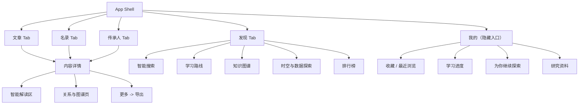

# Modern Android 后端能力扩展接入实施文档

> 实施目标：把 `HeritageOnlineDotNetCore` 已经具备、且适合普通移动端用户消费的后端能力，系统接入 `modern-android`。本计划只描述 Android 客户端的实现，不修改后端接口，不在客户端触发本地 LLM、图谱重建或任何管理员操作。
>
> 目标模块：`/Users/kaisun/Documents/GitHub/heritage-online-android/modern-android`
>
> 后端合同来源：`/Users/kaisun/Documents/GitHub/HeritageOnlineDotNetCore/API-CONTRACT.md`
>
> 实施方式：严格按本文的步骤顺序执行。每一步完成后运行该步骤规定的验证；不要跨阶段把 UI、DTO、Room migration 和导航一次性堆入一个提交。

---

## 0. 文档定位与范围

### 0.1 实施对象

本仓库同时存在两个 Android 客户端：

| 模块 | 定位 | 本计划是否修改 |
| --- | --- | --- |
| 仓库根目录 `app/` | 旧版 Android App，保留为功能参考 | 否 |
| `modern-android/app/` | Kotlin + Compose + Hilt + Ktor + Room 的现代客户端 | 是 |

后续所有文件路径均相对于 `modern-android/`。除非后续明确发起旧版迁移，不要把新 DTO、页面或网络代码复制到根目录旧 `app/`。

### 0.2 当前客户端已经具备的能力

现代客户端已经接入并有页面的能力包括：文章、名录、传承人列表与详情、分页缓存、收藏/最近浏览/阅读路径的本地 Room 实现、搜索 v2、时间线 v2、探索主题、旧学习路径、地区图谱、合集、今日发现、趋势、本周、随机发现、数据故事、主题库、比较、内容 digest、Context 和综合推荐。

因此本计划的重点不是重做这些页面，而是把后端后来新增的能力嵌入现有信息架构：

1. 本地用户档案、服务端收藏/历史/学习进度与个性化旅程。
2. V3 智能详情页、AI 卡片和智能搜索。
3. 知识图谱探索、证据、路径解释、漫游和 AI 推断边的只读展示。
4. 新学习路线、时空探索、分析、排行。
5. 已生成研究资料包、研究报告与内容导出。

### 0.3 明确不放进普通 Android App 的接口

以下接口虽然存在于后端，但它们是本地维护、实验控制或需要管理员密钥的能力，**本计划不在 Android 客户端实现入口，也不把 `X-Heritage-Admin-Key` 编译进 APK**：

| 接口类别 | 不接入原因 |
| --- | --- |
| `/api/knowledge-graph/rebuild*`、图谱投影任务、创建快照 | 会修改投影或长时间占用本机资源，应由本地运维脚本或后端管理工具执行 |
| `/api/ai/jobs/*`、`/api/ai/batch-plans/*/run`、AI batch create/retry/cancel | 会启动本地 LLM 推理，手机不应远程控制宿主机算力 |
| AI 结果 stale 标记/清除、AI 覆盖率补跑计划 | 管理数据质量的后台操作，不是阅读行为 |
| `data-assets/*`、图谱 repair/fix suggestion、edge opportunities、quality score | 面向数据维护者，不应在普通用户的信息架构中制造误导 |
| Research package/report 的 create/retry/cancel/delete | 涉及长任务、管理员密钥及本地磁盘写入；App 仅浏览已完成结果 |
| Cypher 示例、任意管理/维护端点 | 不是用户产品功能，且不能把数据库实验入口暴露给客户端 |

### 0.4 本计划的产品原则

1. **移动端读优先。** 所有新增图谱、AI、研究和分析能力都先做只读消费；用户可写入的仅限自己的收藏、历史和学习进度。
2. **核心内容优先于增强信息。** 文章、名录、传承人的现有详情缓存仍是页面主数据。AI、图谱、推荐不可用时只隐藏或降级自己的区块，不能让详情页整体失败。
3. **图谱以可解释列表为主。** 手机不以大型自由画布作为唯一表达。先用中心节点、关系卡、路径步骤和证据列表保证可读、可访问和可测试；小型关系图仅作为补充。
4. **绝不由 Composable 直接发请求或写库。** 请求经过 `HeritageApiClient -> Repository -> ViewModel -> UiState`；点击写操作经过 Repository，并由 ViewModel 控制一次性事件。
5. **不依赖 localhost。** 真机、外网和局域网访问都必须从 `BuildConfig.HERITAGE_API_BASE_URL` 取得基地址；图片 URL 也必须统一解析。
6. **本地优先且可离线。** 收藏、历史、进度的 UI 先写 Room，再尝试同步后端；断网时记录待同步操作，恢复网络后重放。
7. **不把模型实现细节塞给普通读者。** 默认展示 AI 内容、证据、是否过期等用户可理解的事实；模型名、prompt 版本、原始 JSON 仅供隐藏的开发调试模式，不进入正式页面。

### 0.5 旧接口合同校准是新增功能的前置门槛

仓库中已有 `API_INTEGRATION_PLAN.md` 曾记录过 Search v2、Timeline v2、Explore、Learning Paths、Region Atlas、Collections 和 Detail Context 的 Android DTO 与后端字段可能不一致。该文件是历史审查结论，不能假定它今天仍然完全正确，也不能忽略它。

在开始步骤 2 之前，工程 AI 必须以当前后端 `API-CONTRACT.md` 和真实测试 fixture 为准逐项复核现有 DTO：

| 现有分组 | 必须核对的高风险字段 |
| --- | --- |
| Search v2 | `query`、`facets`、`score` 类型、highlights、matched fields |
| Timeline v2 | item 的 `date`、facets、年份 bucket 计数 |
| Explore / 旧学习路径 | `title`/`subtitle`、topics、sections、cover image 的真实类型 |
| Region Atlas / Collections | totals、breakdown、featured item、generatedAt、collection item 元数据 |
| Detail Context | graph node/edge、recommendation、related item 的 type/id/category/region |

规则如下：

1. 后端已有字段但 Android 未声明时，补齐 DTO 和序列化测试；不得依赖 `ignoreUnknownKeys` 静默吞掉字段。
2. Android 字段名与后端不一致时，优先按后端合同修正，必要时通过 mapper 保持旧 UI 模型稳定。
3. 先修正已有接口的 DTO/fixture/client 测试，再新增本计划中的 V3 或图谱 DTO；不要在同一个 DTO 文件里混合“旧合同修复”和“大量新功能”而难以审查。
4. 若复核后发现历史文档结论已过时，更新或删除过时条目，并以当前实际合同测试为唯一依据。

**前置验收**：现有 Search、Timeline、Explore、Region Atlas、Collections、Detail Context 的 MockEngine/DTO 测试全部通过，且测试 JSON 与后端当前合同字段一致。

> **合同来源优先级**：`API-CONTRACT.md` 是后端提供的稳定接口说明，但应以 **实际 Controller 源码与运行时 Swagger/fixture** 为最终依据。若合同文档与源码存在字段名、query 参数位置或 HTTP 方法不一致，优先按源码实现，并在本计划与本仓库测试 fixture 中同步修正。

### 0.6 UI/UX 实现规范：现代、美观、可访问

新增页面与组件必须遵循 Material3 设计系统，并在此基线之上做到**现代、克制、可访问**。本规范适用于本计划涉及的所有新增 Screen、BottomSheet、卡片与交互。

#### 0.6.1 视觉基础

- **颜色**：继续使用项目现有陶土/红褐主色；新增区块优先使用 `surfaceContainerLow`、`secondaryContainer`、`tertiaryContainer` 等语义色，不引入新的硬编码色值。深色模式必须同步验证。
- **形状**：沿用现有 8.dp 圆角体系；小元素 4.dp，大卡片/ bottom sheet 8.dp。禁止在单个页面混用 12.dp、16.dp、24.dp 等多种圆角。
- **字体**：使用 `MaterialTheme.typography` 层级：页面标题 `headlineSmall`、区块标题 `titleMedium`、卡片标题 `titleSmall`、正文 `bodyMedium`、辅助说明 `bodySmall`/`labelMedium`。避免直接写死字号。
- **间距**：以 4.dp 为基 grid。页面水平内边距统一 16.dp–20.dp；列表项间距 12.dp；卡片内部 16.dp；相关元素之间 8.dp。复杂页面先画 wireframe 再写 Compose。

#### 0.6.2 现代交互模式

- **加载**：首次加载使用与最终布局结构一致的 skeleton，禁止全屏 indeterminate spinner。列表 skeleton 的项数与实际一屏接近；卡片 skeleton 保持真实圆角和间距。
- **空态**：每个列表/区块必须有专属空态：图标（Material 图标，不使用 emoji）、一句标题、一句说明、一个下一步操作（如“去发现”）。空态不是失败提示。
- **错误与重试**：非致命错误使用 inline error card 或 section-level retry button；致命错误使用居中带插画的错误页。retry 必须精确对应具体请求。
- **过渡动画**：页面进入/退出使用 `AnimatedContent` 或 navigation3 默认过渡；列表项使用 `animateItemPlacement`；展开/收起使用 `AnimatedVisibility`。动画时长 200–300ms，使用 `MotionScheme`；必须尊重系统“移除动画”设置。
- **触觉反馈**：收藏、完成 step、生成导出等成功操作可给轻微 `HapticFeedbackType.Confirm`；删除、清空等破坏操作给 `HapticFeedbackType.Reject` 或 `LongPress`。
- **触摸目标**：所有可点击元素最小 48.dp；图标按钮使用 `IconButton` 保证触摸区域；列表项整卡可点击时，内部按钮仍要有独立触摸区。

#### 0.6.3 内容密度与可读性

- **图片**：列表缩略图统一比例（如 16:10 或 4:3），使用 `ContentScale.Crop` 并保留 `contentDescription`；无图时显示类型占位图标，不显示空白或 broken image。
- **文本截断**：标题最多 2 行，正文 snippet 最多 2–3 行，使用 `TextOverflow.Ellipsis`。关键词 chip、reason 列表必须设最大显示数，展开由用户触发。
- **信息层级**：一个卡片内不超过 3 层信息：主标题、1–2 行副信息、1 行动作或标签。不要把 score、edge type、model name 等技术字段直接塞进卡片。

#### 0.6.4 可访问性

- 所有新增图标按钮必须有 `contentDescription`；纯装饰图标设 `contentDescription = null`。
- 自定义复合组件提供合并语义或清晰遍历顺序；底部弹窗标题用 `ModalBottomSheet` 的 `sheetContent` 语义。
- 颜色对比度满足 WCAG AA；不要仅依赖颜色传达状态（如 AI inferred 关系除颜色外还有文字 badge）。

#### 0.6.5 响应式与大屏

- 列表在宽屏（>600dp）自动切换为 2 列网格；详情页在折叠屏/平板上考虑双窗格（但第一版允许保留单窗格）。
- 所有 `LazyColumn`/`LazyVerticalGrid` 正确设置 `contentPadding`，避免被系统栏或底部导航遮挡。

#### 0.6.6 UI 验收清单

每个新增 Screen 合并前必须回答：
1. 是否实现了 skeleton、空态、错误态三种状态？
2. 是否在深色模式、字体放大 1.3 倍、屏幕旋转后仍不重叠？
3. 是否所有可见文案来自 string resource 且 wire value 已映射？
4. 是否所有可点击元素触摸目标 ≥48.dp？
5. 是否为该 Screen 编写了 `@Preview`（至少 light/dark 各一），并在预览中覆盖空态与有数据态？
6. 是否有至少一条 Compose 测试验证空态/错误态/核心交互？

---

## 1. 后端能力盘点与客户端取舍

### 1.1 本次应接入的 API 分组

| 优先级 | 分组 | 后端接口 | Android 入口 |
| --- | --- | --- | --- |
| P0 | 连接与媒体基础 | 所有接口返回的内容/图片 URL | 全局网络层、全局图片组件 |
| P0 | 本地用户状态 | `/api/local-user/*`、`/api/local-user/journeys*` | 我的页、详情页收藏、学习路线 |
| P0 | V3 内容智能 | `/api/v3/pages/article/{id}`、`/api/v3/pages/directory-item/{id}`、`/api/v3/pages/inheritor/{id}`、`/api/v3/content/{type}/{id}/intelligence`、`/api/v3/articles/{id}/ai-card`、`/api/v3/directory-items/{id}/ai-card`、`/api/v3/inheritors/{id}/ai-card` | 三类详情页 |
| P0 | 智能搜索 | `/api/v3/search/intelligent` | 现有搜索页的“智能”模式 |
| P1 | 图谱阅读 | `/api/knowledge-graph/*/neighbors|similar|explore|evidence|ai-inferred` | 详情页“关系”入口、发现页 |
| P1 | 路径/漫游 | `/api/knowledge-graph/path/explain`、`/trails/*`、`/communities`、`topics/*/map` | 图谱页、发现页主题入口 |
| P1 | 新学习路线 | `/api/learning-routes*` | 发现页“学习路线”、我的页学习 tab |
| P1 | 个性化探索 | `/api/local-user/journeys`、`/signals` | 我的页“为你继续探索” |
| P2 | 数据探索 | `/api/spacetime/*`、`/api/analytics/*`、`/api/rankings*` | 发现页“数据探索” |
| P2 | 已生成研究内容 | `/api/research-packages`、`/api/research-reports` 的 GET 接口 | 我的页“研究资料” |
| P2 | 内容导出 | `/api/exports/templates`、`preview`、`content` | 详情页更多菜单 |

### 1.2 新增页面在现有信息架构中的位置

不要新增第五个底部导航项。现在的四个一级入口“文章 / 名录 / 传承人 / 发现”已经对应主内容和探索入口；新增能力应落在现有 `DiscoveryNavHost` 和“我的”隐藏页面中。



### 1.3 新增路由键

在 `feature/discovery/DiscoveryRouteState.kt` 中扩展 `DiscoveryRouteKey`，并同步序列化器、`toRouteState()`、`toRouteKey()` 与 `DiscoveryNavigation.kt`。新增键应使用小而明确的数据参数，禁止传整个 DTO：

```kotlin
data object IntelligentSearchPage : DiscoveryRouteKey
data object LearningRoutesPage : DiscoveryRouteKey
data class LearningRouteDetailPage(val routeId: String) : DiscoveryRouteKey
data object KnowledgeGraphHubPage : DiscoveryRouteKey
data class GraphExplorePage(val type: String, val id: String, val initialTab: GraphTab) : DiscoveryRouteKey
data class TopicGraphMapPage(val topicType: String, val topicKey: String) : DiscoveryRouteKey
data class GraphTrailPage(val source: TrailSource) : DiscoveryRouteKey
data object SpacetimePage : DiscoveryRouteKey
data object AnalyticsPage : DiscoveryRouteKey
data object RankingsPage : DiscoveryRouteKey
data class RankingDetailPage(val rankingId: String) : DiscoveryRouteKey
```

`GraphTab`、`TrailSource`、分析维度等枚举应定义为稳定的 wire-value enum，序列化时保存名称或显式 wire value。恢复进程时无法识别的值必须回退到首页或默认 tab，不能崩溃。

“我的”目前不是 `DiscoveryNavHost` 的一部分。学习进度、旅程、资料页可以先作为 `MyPage` 内的 tab；当其中某一项需要进入内容详情时，复用现有 `MyPageDestination` 分发到文章/名录/传承人 tab，不能另造一个详情页面。

### 1.4 有意识地延后或复用的读取接口

不是每个只读端点都应立即生成一个 Android 页面。以下接口不遗漏，只是有明确的复用/延后理由：

| 接口分组 | 本计划的处理 | 原因 |
| --- | --- | --- |
| `/api/recommendations/explain/*`、`compare/*`、`strategies` | 由 V3 content page 的 recommendations 和图谱路径解释优先覆盖 | 避免为同一推荐关系展示两套入口；未来需要“策略实验”再单独设计 |
| `/api/ai-content/*`、旧 `/api/*/ai-summary` | 优先使用 V3 AI card/content page | V3 带有 `hasAi`、stale 和 section status，客户端降级更完整 |
| `/api/knowledge-context/*`、GraphRAG pack 即时构建 | 延后 | 适合研究/后端组合层；手机端已有图谱、证据、路线和已完成 research package 可消费 |
| 图谱 snapshot/diff/replay、algorithms、insights/hubs | 延后到“开发者/研究模式” | 是数据研究与维护视角，不是普通阅读流程；不能挤占发现首页 |
| `/api/v3/ai-coverage/*`、quality samples/model comparison | 不进入普通用户 App | 面向模型质量运营，不应给读者造成“需要维护 AI”的负担 |
| `/api/search/v3` | 不新增 | 现有 search v2 加本计划的 `/api/v3/search/intelligent` 已覆盖稳定与智能两条路径 |

以后要扩展这些接口时，必须先写出目标用户、入口、读取频率、空态和为什么不能复用当前页面；仅仅因为后端存在 endpoint 不是新增页面的理由。

---

## 2. 分阶段、分步骤实施计划

## 阶段 A：先建立可靠的远程连接、URL、错误与测试底座

### 步骤 1：确认基线、保护现有行为

**目的**：把本计划建立在可回归的现代客户端基线上。

**操作**：

1. 进入 `modern-android/`，执行 `./gradlew :app:verifyLocal`。
2. 记录当前失败项；只有确认是既有失败时才能继续。不要把新 API 接入和旧失败混在同一修复里。
3. 确认 Room 当前版本与 `app/schemas/` 一致；当前数据库版本为 `10`，后续新增同步队列表时必须升级版本并编写 migration。
4. 确认 `modern-android/WINUI3_MIGRATION_CLIENT_SPEC.md` 若仍是用户未跟踪文件，保持原样，不纳入本计划的修改范围。

**验收**：`verifyLocal` 成功；或已有失败已在变更说明中独立记录。

### 步骤 2：建立 API 合同清单和端点所有权

**新增文件**：`app/src/main/java/com/duckylife/heritage/modern/core/network/ApiEndpointCatalog.kt`

**实现要求**：

1. 文件不是运行时路由表，也不拼 URL；它只用 KDoc 将本计划新增的 endpoint、DTO 文件、Repository 和 UI feature 对齐，防止日后同一路径被多个 feature 随意复制。
2. 按以下 group 建立注释块：`LocalUser`、`AiProduct`、`KnowledgeGraph`、`LearningRoutes`、`DataExplore`、`Research`、`Export`。
3. 不要把 REST path 散落在 ViewModel、Screen 或导航文件；所有真实 URL 仍只能出现在 `KtorHeritageApiClient`。

**验收**：搜索 `"api/v3/"`、`"api/local-user/"`、`"api/knowledge-graph/"` 时，除了测试 fixture、合同目录和 `HeritageApiClient.kt` 外，不出现生产代码的散落路径。

### 步骤 3：把远程 API 地址变成明确的构建配置

**修改文件**：

- `app/build.gradle.kts`
- `README.md`
- `core/network/HeritageApiConfig.kt`
- `di/NetworkModule.kt`

**实现逻辑**：

1. 保留现有 `heritageApiBaseUrl` Gradle property，但把它定义为唯一的 API 根地址来源，格式要求为 `https://host[:port][/optional-prefix]`；代码在使用前统一 `trimEnd('/')`。
2. 本地模拟器开发可继续显式传入宿主地址，例如 `-PheritageApiBaseUrl=https://10.0.2.2:5078`。不要将 `localhost` 写到 DTO、图片组件或任何页面。
3. 真机/发布构建通过 Gradle property 配置已验证的 HTTPS 公网地址，例如：

   ```bash
   ./gradlew :app:assembleDebug \
     -PheritageApiBaseUrl=https://<你的公开域名>/
   ```

   实际域名、端口和反向代理路径只在本机 `~/.gradle/gradle.properties` 或 CI/构建环境中配置，不提交个人网络地址。
4. release 的 `HERITAGE_TRUST_SELF_SIGNED_CERTS` 必须保持 `false`。公开 Caddy/Nginx 证书应由系统信任；不得为了绕过证书问题在 release 中启用 trust-all。
5. 在 `HeritageApiConfig` 增加 `requireHttpsForRelease: Boolean`，并在 `NetworkModule`/创建 client 前校验 release URL 是 `https`。若不符合，在启动日志/开发检查中给出明确错误，而不是静默发出明文请求。

**验收**：

1. 使用 `-PheritageApiBaseUrl` 的 Debug 构建能通过。
2. Release 在 `http://` URL 或 trust-all 配置下被拒绝。
3. README 说明模拟器、局域网真机、公开 HTTPS 三种运行方式，且没有把真实个人 IP/密码写入仓库。

### 步骤 4：新增统一的服务端 URL 解析器

**新增文件**：`core/network/HeritageUrlResolver.kt`

**修改文件**：

- `ui/component/HeritageSurface.kt`
- `ui/component/DiscoveryItemCard.kt`
- `ui/preview/ImagePreviewUrl.kt`
- 所有直接把 `coverImageUrl`、`displayUrl`、`thumbnailUrl` 交给 Coil 的位置

**实现逻辑**：

1. 后端可能返回完整公开 URL、根相对 URL（`/images/...`）或极少数历史 `localhost` URL。解析器输入为原始字符串和 `HeritageApiConfig.baseUrl`。
2. 处理顺序必须固定：
   - `null`、空串、纯空白：返回 `null`。
   - 已是 `https://` 或 `http://` 的绝对 URL：原样返回；不要错误地拼接 API base URL。
   - 以 `/` 开始的相对 URL：取 API base URL 的 scheme + authority，再拼接路径。
   - 不以 `/` 开始的相对 URL：按 API 根目录 resolve。
   - 绝对 URL 的 host 是 `localhost`、`127.0.0.1` 或 `::1`：在普通用户构建中视为不可达并返回 `null`，同时以 debug 日志记录；不要把手机的 localhost 当成服务端。
3. `MediaAssetDto.bestUrl()`、`previewUrl()` 等 helper 先挑选候选 URL，再交给 resolver；不要每个卡片各自实现字符串判断。
4. Coil 的 `AsyncImage` 只接收解析后的 URL；解析失败时走既有图片占位符。
5. 对公共 API base URL 不做 host pinning；证书链交给 Android 系统校验。只有 Debug self-signed 本地调试保留现有专用逻辑。

**测试**：新增 `HeritageUrlResolverTest`，至少覆盖绝对 HTTPS、根相对、相对路径、空值、`localhost`、带端口的 base URL、带 path prefix 的 base URL。

**验收**：列表、详情、预览三类图片组件共用一个 resolver；代码中不再出现以字符串 replace 方式处理图片 host 的重复逻辑。

### 步骤 5：建立稳定的本地 Profile ID 和请求头

**新增文件**：

- `core/profile/LocalProfileRepository.kt`
- `core/profile/DataStoreLocalProfileRepository.kt`
- `core/profile/LocalProfile.kt`

**修改文件**：

- `di/DataModule.kt`
- `core/network/HeritageApiClient.kt`
- `di/NetworkModule.kt`

**实现逻辑**：

1. 后端本地用户接口通过 `X-Heritage-Profile-Id` 区分用户，不使用账号、OAuth 或密码。
2. 首次安装时生成一次 profile ID，格式为 `android_` 加 UUID 去掉大括号后的字符串。例如 `android_550e8400-e29b-41d4-a716-446655440000`；长度小于 64，且只包含字母、数字、`_`、`-`，符合后端白名单。
3. 将 ID 保存到独立的 DataStore key。读取失败时不能每次请求都重新生成；先在同一事务中写入后返回，保证一个安装实例始终对应同一个 profile。
4. Ktor 增加一个请求插件或统一 default request hook，在所有正常 API 请求上附带 `X-Heritage-Profile-Id`。服务端无需该 header 的接口会忽略它；统一添加比各个 LocalUser method 手工添加更不易漏。
5. 注意后端对 profile ID 的读取方式不一致：LocalUser 全系依赖 header；`/api/v3/pages/*` 的 `includeLocalState=true` 需要把同一份 profile ID 作为 query 参数 `profileId` 传入；`/api/learning-routes/{routeId}/next` 也通过 query 参数 `profileId` 读取。Client 实现层应暴露 `currentProfileId()` 给需要 query 参数的接口使用，而不是让每个 Repository 自己拼 header。
6. 不增加任何管理员 key header，不在客户端保存后端密码、MongoDB 密码、Neo4j 密码或 LLM 配置。
7. 为测试提供 `FakeLocalProfileRepository("android_test_profile")`，避免随机 ID 使 MockWebServer 断言不稳定。

**验收**：Ktor MockEngine 测试能断言普通 GET 和 LocalUser POST 均发送同一个 profile header；重建 Repository 不会改变该 profile ID。

### 步骤 6：统一解析 API 错误与局部降级状态

**新增/修改文件**：

- `ui/error/ApiFailure.kt`
- `ui/error/ErrorMessage.kt`
- `core/network/HeritageApiClient.kt`
- 现有 ViewModel 的异常映射辅助代码

**实现逻辑**：

1. 将 Ktor `ResponseException` 解析为 `ApiFailure.Http(statusCode, problemTitle, detail, traceId)`；后端 ProblemDetails 字段缺失时允许为空。
2. 统一映射：`400` 为“请求参数无效”，`401/403` 为“当前设备无权限”，`404` 为“内容已不存在”，`409` 为“当前操作冲突”，`413` 为“内容过大”，`429` 为“请求过于频繁”，`503` 为“本地服务暂时不可用”，网络 IOException 为“网络不可用”。
3. 对 V3 页面、图谱、AI、分析等增强接口，ViewModel 不能把增强接口 `503` 升级为整个内容详情的 fatal error。应把该 section 的状态写为 `Unavailable(errorKind)`，核心详情继续显示。
4. `404` 也要按语义处理：内容主详情的 `404` 是整页错误；AI summary 的 `404` 是 `Missing`；图谱路径没有路径时后端是 `200` 且 `found=false`，不能误显示为错误。
5. 不在 UI 层通过字符串包含 "404"、"Neo4j" 来判断错误。

**验收**：至少为 400、404、503 和网络断开各写一个 unit test；现有 `ErrorMessage` 的中文文案保持一致。

### 步骤 7：按领域拆分新增 DTO 和 query 模型

**新增目录**：`core/network/dto/advanced/`

**新增文件建议**：

| 文件 | DTO 范围 |
| --- | --- |
| `LocalUserDtos.kt` | profile、favorites、history、progress、summary、journeys |
| `AiProductDtos.kt` | V3 AI card、content intelligence、content page、intelligent search |
| `KnowledgeGraphDtos.kt` | nodes、edges、paths、similar、explore、community、trail、evidence、AI inferred |
| `LearningRouteDtos.kt` | route summary/detail/step/next |
| `DataExploreDtos.kt` | spacetime、analytics、rankings |
| `ResearchDtos.kt` | read-only package/report/artifact metadata |
| `ExportDtos.kt` | templates、preview、content result |

**实现逻辑**：

1. 每个 DTO 用 `@Serializable` 和与后端 JSON 相同的字段名；只有 Kotlin 保留字或现有命名约定冲突时才用 `@SerialName`。
2. 共用图谱节点、边、内容定位模型只能定义一份。例如 `GraphContentRefDto(type, id, title, subtitle, ...)` 不应同时在 AI、图谱、旅程文件中复制三套。
3. 将 query 对象放在 `HeritageQueries.kt` 或按领域拆出的 `AdvancedQueries.kt`。必须使用 enum/密封类型表达白名单：内容类型、topic type、graph tab、journey strategy、learning difficulty、rank metric 等，禁止让 Screen 传任意字符串。
4. 只把后端可选字段声明为 Kotlin nullable；不要为了“将来可能有”把所有字段做成 nullable，避免 UI 掩盖合同错误。
5. `generatedAt`、`updatedAt` 等时间优先保留 ISO 字符串 DTO，在 Repository mapping 或 UI formatter 中解析；不要让网络反序列化在格式变化时直接崩溃。
6. `ignoreUnknownKeys = true` 保持开启；新增已知字段必须有 fixture 测试，不能依赖该配置掩盖漏字段。

**验收**：每个文件至少有一份最小成功 JSON 和一份可选字段缺失 JSON 的反序列化测试；任何 enum 未知 wire value 必须可降级为 `Unknown(rawValue)` 或空结果，而不是抛出序列化异常。

### 步骤 8：按功能建立 API Client 与 Repository 边界

**新增接口/实现**：

- `LocalUserApi` / `LocalUserRepository`
- `ContentIntelligenceApi` / `ContentIntelligenceRepository`
- `KnowledgeGraphApi` / `KnowledgeGraphRepository`
- `LearningRoutesApi` / `LearningRoutesRepository`
- `DataExploreApi` / `DataExploreRepository`
- `ResearchApi` / `ResearchRepository`
- `ContentExportApi` / `ContentExportRepository`

**实现逻辑**：

1. `HeritageApiClient` 可以作为现有总入口继续存在，但新增接口分组应通过 Kotlin delegation 或领域接口拆出，避免它无限膨胀为数百个无分类方法。
2. `KtorHeritageApiClient` 仍是唯一拼 endpoint 的实现；领域 API 只是类型安全的 facade，而不是新的 HttpClient。
3. 每个 Repository 只暴露屏幕真正需要的业务方法。例如 `KnowledgeGraphRepository.loadExplore(type, id, depth, includeTopics)`，而不是暴露裸 URL 或 `HttpResponse`。
4. 所有 `limit`、`depth`、`pageSize` 在 query builder 内做本地 clamp，和后端边界一致；即使后端会 clamp，客户端也不能向它发送负数或超大值。
5. `type/id` 在发请求前验证非空；ObjectId 格式仅在用户可输入/可恢复路由时检查。不要对普通内容 DTO 的 id 再造一套随机正则校验。
6. 任何 API 调用均必须遵守 coroutine cancellation；不可用 `runBlocking`、全局协程或在 Composable 的 `remember` 块里启动请求。

**验收**：新增 feature 的 ViewModel 不 import `io.ktor.*`，Screen 不 import Repository 实现；Mock API/Repository 可以独立替换。

### 步骤 9：定义派生数据的缓存策略

**实现策略**：

| 数据 | 首次版本缓存策略 | 原因 |
| --- | --- | --- |
| 内容主详情、主列表、banner | 保持现有 Room + Paging 策略 | 已有离线基线，不能回退 |
| 收藏、历史、学习进度、待同步操作 | Room 持久化 | 用户写入不能因离线丢失 |
| V3 content page、AI 卡片 | ViewModel 内存状态，打开详情即刷新 | 派生数据可快速变化且核心详情已有缓存 |
| 图谱、漫游、时空、分析、排行 | ViewModel 内存状态，手动重试 | 结果可能依赖 Neo4j，不宜先做复杂持久化 |
| 研究资料包/报告列表 | ViewModel 内存状态，页面进入刷新 | 只读且数量有限 |

禁止为了“全部离线”在本阶段给每一种后端响应建 Room 表。先让用户产生的状态可靠离线，再用真实使用频率决定是否缓存派生阅读数据。

**验收**：新增网络响应没有未经说明的 `fallbackToDestructiveMigration`；新增 Room 表只服务本地写入/同步，不承担临时图谱查询缓存。

---

## 阶段 B：把“我的”从纯本地列表升级为本地优先的个人学习空间

### 步骤 10：定义个人数据同步模型

**新增 Room entity/DAO**：

- `LocalProfileStateEntity`：单行 profile 元数据、最近服务端同步时间、同步错误摘要。
- `ProfileFavoriteEntity`：服务端收藏的轻量快照与同步状态。
- `ProfileHistoryEntity`：服务端历史快照、浏览次数、最后位置。
- `ProfileLearningProgressEntity`：每条 route 的完成步骤、当前步骤、百分比、更新时间。
- `PendingProfileOperationEntity`：离线待发送操作。

**关键设计**：

1. 保留已有 `SavedContentEntity` 和 `ReadingPathEventEntity`。它们是原有本地收藏、最近浏览、阅读路径，不能直接删除或改为远程表。
2. 这次新增的 `Profile*Entity` 是后端 LocalUser 的镜像；`SavedContentEntity` 仍保证旧 UI 和离线访问不回归。
3. 详情页的“收藏”操作要同时更新本地 `SavedContentEntity` 和 `ProfileFavoriteEntity` 的乐观状态；成功后用服务端返回值更新 snapshot，失败后保留本地状态并创建 pending operation。
4. `PendingProfileOperationEntity` 至少包含：`operationId`、`kind`（addFavorite/removeFavorite/recordHistory/updateProgress/clearHistory）、`deduplicationKey`、JSON payload、`createdAt`、`attemptCount`、`lastError`。
5. 同一个 target 的收藏操作按 `deduplicationKey = favorite:{type}:{id}` 合并，只保留最后意图。例如先收藏后取消收藏，离线队列最终只留下 remove；不能重放两个相反请求。
6. `recordHistory` 可按 `history:{type}:{id}` 在短时间内去重：同一详情页一次可见会话只记录一次，避免 Compose 重组导致浏览次数暴涨。

**数据库迁移**：

1. `HeritageDatabase.version` 增加 1。
2. 在 `HeritageMigrations.kt` 添加明确 SQL migration，创建表、索引和唯一约束。
3. 为 `profileId + targetType + targetId`、`deduplicationKey`、`updatedAt` 建必要索引。
4. 生成新的 schema JSON，并补 migration instrumentation test。

**验收**：旧用户升级后原收藏、最近浏览、阅读路径仍存在；新同步表为空但 App 可正常启动。

### 步骤 11：实现个人状态同步仓库与重放器

**新增文件**：

- `core/profile/LocalUserSyncRepository.kt`
- `core/profile/LocalUserSyncWorker.kt`
- `core/profile/ProfileSyncScheduler.kt`

**实现逻辑**：

1. 使用 WorkManager，并在 Gradle 增加对应依赖。Worker 使用 `Constraints(NetworkType.CONNECTED)`，不在主线程运行。
2. App 启动、回到前台、用户下拉刷新“我的”、以及每次本地写操作后，调度唯一工作 `heritage-profile-sync`；使用 `ExistingWorkPolicy.KEEP`，防止并发重复同步。
3. 同步顺序固定：
   - 读取并按创建时间重放 pending operations；成功后删除该操作。
   - 拉取 `/api/local-user/summary`。
   - 分页拉取 favorites、history、learning-progress 并 upsert 本地镜像。
   - 用服务端结果刷新 `LocalProfileStateEntity`。
4. pending 操作遇到网络错误或 `503`：返回 `Result.retry()`，保留队列；遇到 `400`/不可恢复 `404`：记录 `lastError` 并从队列移除，同时把 UI 状态标记为“未同步，需要重试”，不能无限重试坏 payload。
5. 服务器收藏 target 不存在导致 `404` 时，移除远程镜像对应项，但不自动删除旧 `SavedContentEntity`，让用户仍能看到本地缓存并可手工清理。
6. 不实现跨设备冲突编辑器。当前是个人本地学习用途，冲突规则为“本设备最后一次成功写入优先”；服务端更新时间仅用于展示。

**验收**：离线收藏/取消/记录进度后关闭 App，再恢复网络重启，最终服务端与本地镜像状态一致；相反收藏操作不会在服务端产生闪烁式重复写入。

### 步骤 12：接入 LocalUser API 方法与 DTO 测试

**接口清单**：

```text
GET    /api/local-user/profile
GET    /api/local-user/summary
GET    /api/local-user/favorites
POST   /api/local-user/favorites
DELETE /api/local-user/favorites/{targetType}/{targetId}
GET    /api/local-user/history
POST   /api/local-user/history
DELETE /api/local-user/history
GET    /api/local-user/learning-progress
PUT    /api/local-user/learning-progress/{routeId}
GET    /api/local-user/journeys
GET    /api/local-user/journeys/signals
```

**Header 与身份**：

1. 所有 `/api/local-user/*` 端点均通过 **`X-Heritage-Profile-Id`** 请求头区分用户。未提供时后端默认使用 `"local"`，但客户端必须始终发送本机生成的 profile ID。
2. Header 值必须满足正则 `^[a-zA-Z0-9_-]{1,64}$`；首次生成时采用 `android_` + UUID（去大括号），例如 `android_550e8400-e29b-41d4-a716-446655440000`。
3. 这些端点**不要**把 `profileId` 放进 body 或 query（除后端明确要求的 `/api/v3/pages/*` 与 `/api/learning-routes/{routeId}/next` 外）。

**实现要求**：

1. favorites/history 使用明确的 `page`、`pageSize` query；首次同步可使用 `pageSize=100`，随后根据 `hasMore` 循环，循环次数必须设置上限并支持 cancellation。
2. POST favorite body 只发送后端合同允许的 `targetType`、`targetId`、`tags`、`note`。第一版不提供收藏备注编辑 UI，所以 tags/note 发送空值即可，不要伪造标题或图片字段。
3. `targetType` 只允许规范化为 `article`、`directoryItem`、`inheritor`；`all` 在收藏/历史接口不可用。
4. 详情浏览成功后在 ViewModel 中调用 `recordHistory(type, id, lastPosition = null)`；不要从 `onDispose` 调用，以免进程被杀时不可预测。
5. 进度 body 的 `completedStepIds` 去重、保持 route step 的原顺序；`currentStepId` 必须是 route 内当前步骤或 null。服务端会对 `completedStepIds` 与真实 step 取并集，并自动计算 `percent` 和 `completedAt`。
6. `DELETE /api/local-user/history` 无路径/查询参数，清空当前 profile 全部历史，返回被清除条数。

**测试**：验证 header、POST/PUT/DELETE method、path segment 编码、分页 `hasMore`、空 progress、404 target、503 retry 分类。

### 步骤 13：改造详情页收藏与浏览记录的调用点

**修改文件**：三类详情 ViewModel 和详情 Screen，共用已有 `SavedContentRepository` 调用路径。

**实现逻辑**：

1. 收藏图标仍放在详情页顶栏右侧，位于“返回”之外的 action 区，保持已有视觉位置和无障碍 `contentDescription`。
2. 点击后立即更新图标和本地收藏列表；不要等网络返回才切换，避免真机网络抖动时显得无响应。
3. ViewModel 把 snapshot 同时交给 `SavedContentRepository` 和 `LocalUserSyncRepository.toggleFavorite(...)`；两个写入必须在 repository 层按顺序封装，Screen 不知道双写细节。
4. 主内容成功解析并显示一次后，ViewModel 只记录一次 history。以 `contentType + canonical Mongo id` 为键；从 sourceId/sourceUrl 路由解析后必须使用最终 detail 的 canonical id。
5. 记录历史失败不显示 Snackbar，不影响阅读；只有用户主动进入“我的”看到同步状态时才显示轻量提示。

**验收**：频繁重组、屏幕旋转、从图谱返回详情都不会重复发 history POST；收藏在离线时立即可见且进入“我的”后仍存在。

### 步骤 14：重做“我的”页的信息架构但保留旧数据

**修改文件**：`feature/my/MyPage.kt`、`feature/my/MyPageViewModel.kt`（建议从当前单文件拆出）、strings、共享组件。

**页面布局（从上到下）**：

1. 顶部 app bar：左侧返回图标，中间标题“我的学习空间”，右侧同步状态图标。同步中显示细小进度；失败显示提示图标，点击打开同步详情 bottom sheet；成功不占额外空间。
2. Profile 概览行：不显示用户账号或个人敏感数据。左侧圆形“本地”图标，中间两行“本设备学习档案”与 `收藏 X · 浏览 Y · 学习路线 Z`，右侧“刷新”图标按钮。
3. `SecondaryTabRow` 改为五个 tab，横向可滚动：`收藏`、`浏览`、`学习`、`旅程`、`资料`。保留现有 `阅读路径` 作为“浏览”页内部的第二段，不再单列顶级 tab，防止 tab 过多。
4. 每个 tab 内容使用 `LazyColumn`，横向内边距 `20.dp`，项间距 `12.dp`，顶部/底部间距 `14.dp`；重用 `HeritageListCard` 和现有 color scheme，卡片圆角不超过现有系统值。

**验收**：小屏宽度下 tab 不截断标题；返回后仍回到原 tab；旧收藏、最近浏览和阅读路径仍能打开详情。

### 步骤 15：实现“收藏”和“浏览”tab 的合并显示规则

**收藏 tab 页面元素**：

1. 顶部显示“已收藏” section header，副标题显示最近同步时间或“仅保存在本机，等待同步”。
2. 内容卡左侧为封面/占位图，中间为标题、类型 badge、tags，右侧为收藏实心图标按钮。
3. 点击整卡打开对应内容详情；点击收藏按钮弹出简短确认 snackbar 后取消收藏。
4. 无内容时显示图标、标题“还没有收藏内容”、说明“在内容详情页点按收藏图标即可保存在本机”，以及文本按钮“去发现”跳转到发现 tab。

**浏览 tab 页面元素**：

1. 第一段“最近浏览”：显示标题、类型、最后浏览时间、浏览次数；右上角仅在非空时显示“清空”。
2. 清空是 destructive action，必须二次确认；确认后立即清空本地镜像和创建 `clearHistory` pending operation。
3. 第二段“阅读路径”：保留已有 event timeline；标题改为“本机阅读路径”，明确它记录 App 内跳转而不是服务端 history。
4. 远程 history 加载失败但 Room 有旧数据时继续显示旧数据，在顶部显示一行低优先级“当前显示离线记录”。

**验收**：收藏与浏览均可在无网状态显示最后成功同步的数据；“清空浏览”不会误删收藏或阅读路径。

### 步骤 16：实现“学习”tab 与学习进度状态

**页面元素**：

1. 顶部“正在学习”：显示 `LocalLearningProgressDto.percent > 0 && < 100` 的 route。每张卡包括封面小图、标题、难度 chip、线性进度条、`已完成 n/m`、右侧“继续”按钮。
2. 第二段“已完成”：显示 `percent == 100`；卡片以完成日期代替进度条，仍可“再学一次”。
3. 空态：标题“从一条路线开始”，说明文字一行，按钮“浏览学习路线”跳转到 `LearningRoutesPage`。
4. 页面不提供“手工修改百分比”输入。进度只能由路线详情中的步骤 checkbox 驱动，避免 completedStepIds 与真实 step 不一致。

**验收**：同步到的远程进度和离线 pending 进度合并后百分比正确；进入一条 route 后“继续”定位到当前或下一未完成 step。

### 步骤 17：实现“旅程”tab

**接口**：`GET /api/local-user/journeys`、`GET /api/local-user/journeys/signals`。

**页面元素**：

1. 顶部标题“为你继续探索”，右侧 strategy 下拉菜单，选项：`均衡`、`继续学习`、`尝试新内容`、`深入探索`，对应 `balanced`、`continue`、`novelty`、`deepDive`。默认 `balanced`。
2. 下方显示一行信号摘要，例如“依据：收藏的传统技艺、最近浏览的浙江内容、正在学习的路线”。无信号时显示“多浏览或收藏一些内容后，这里会逐渐更懂你的探索方向”。
3. 每个推荐卡包含：类型 badge、标题、subtitle、最多两条原因、分数不直接显示为数字；右下角有“查看关系”文字按钮，进入 `GraphExplorePage` 的“相似”tab。
4. 若响应带 trail，在卡片列表之后显示“这次旅程的连接线索”，用最多 4 个编号节点的横向/换行步骤条；点击任一节点打开详情。
5. `cold_start`、`graph_unavailable` 等 warning 映射成温和说明，不能将后端 warning 原文直接展示。

**加载/错误规则**：首次加载 skeleton 3 张卡；空结果为专用空态；503 显示“关联服务暂时不可用，可继续浏览收藏内容”并保留 strategy 控件以供重试。

**验收**：切换 strategy 会取消旧请求；旧响应不能覆盖新 strategy 的 UI。

### 步骤 18：个人空间阶段测试

**必须新增测试**：

1. `LocalProfileRepositoryTest`：第一次生成、之后稳定读取、格式符合白名单。
2. `LocalUserSyncRepositoryTest`：离线队列合并、成功删除、503 retry、400 terminal failure。
3. `ProfileDatabaseMigrationTest`：从版本 10 升级后旧表数据仍可读。
4. `MyPageViewModelTest`：五个 tab 状态、刷新、空态、旅程 strategy race condition。
5. `MyPage` Compose test：tab 可点击、清空二次确认、无障碍标签存在。

**阶段验收命令**：

```bash
cd /Users/kaisun/Documents/GitHub/heritage-online-android/modern-android
./gradlew :app:testDebugUnitTest --tests '*LocalProfile*' --tests '*LocalUser*' --tests '*MyPage*'
./gradlew :app:verifyLocal
```

---

## 阶段 C：把 AI 和 V3 智能信息安全地并入现有内容详情与搜索

### 步骤 19：接入 V3 content page，作为增强层而非主详情替换

**接口**：

```text
GET /api/v3/pages/article/{id}
GET /api/v3/pages/directory-item/{id}
GET /api/v3/pages/inheritor/{id}
```

**实现逻辑**：

1. 三类详情页继续先使用当前 `ArticleDetailDto`、`DirectoryItemDetailDto`、`InheritorDetailDto` 和 Room 缓存加载主内容。
2. 主内容解析出 canonical Mongo id 后，异步调用 V3 page：`includeAi=true`、`includeGraph=true`、`includeRecommendations=true`、`includeLocalState=true`、`includeDigest=true`、`includeExportHints=false`、`recommendationLimit=8`、`neighborLimit=12`。`profileId` 作为 **query 参数**传入（该接口不读取 `X-Heritage-Profile-Id` header）；`includeLocalState=true` 时 `profileId` 必填。
3. 由 `ContentIntelligenceRepository` 将 response 的 `sectionStatus` 映射为每个区块自己的 `Ready`、`Empty`、`Missing`、`Unavailable`、`Disabled`，不要仅用一个 Boolean `isLoading`。
4. V3 page 成功后，先只在新组件中消费它；不要马上删除旧 digest/context/blended 请求。待新组件被 DTO、UI、真实设备共同验收后，再以单独步骤逐步停用重复请求。
5. V3 page 400（常见于来源路由尚未解析为 ObjectId 或缺少 `profileId`）时只记录开发日志并跳过增强层；主详情仍可阅读。

**验收**：无 AI 结果、Neo4j 关闭、推荐为空时，三类原详情页仍可完整显示文字、图片、收藏和原有 Context。

### 步骤 20：抽取三类详情共用的“智能内容状态”

**新增文件**：

- `feature/detail/intelligence/ContentIntelligenceUiState.kt`
- `feature/detail/intelligence/ContentIntelligenceViewModelDelegate.kt`
- `feature/detail/intelligence/DetailIntelligenceSection.kt`

**实现逻辑**：

1. 三个现有详情 ViewModel 各自保留主详情的缓存/刷新逻辑，但通过 delegate 共享增强请求、错误降级、重试和跳转事件。
2. UiState 至少包含：`page`、`isLoading`、`loadError`、`aiSection`、`graphSection`、`recommendationSection`、`digestSection`、`warnings`。
3. delegate 只接受 canonical `ContentRef(type, id)`；由各详情 ViewModel 决定何时提供 ref，避免 `sourceId`/`sourceUrl` 与 V3 ObjectId 混用。
4. 每个 request 使用当前 ViewModel scope；详情切换到新 id 时取消旧 job，并为结果加 ref 校验。
5. UI 不显示 raw JSON、source hash、prompt 版本或内部 warning code。

**验收**：三类详情实现没有复制三遍同一套 `loadIntelligence()`；清晰的接口边界允许 fake delegate 进行测试。

### 步骤 21：设计并实现详情页“智能解读”区块

**放置位置**：详情主正文和基础事实区之后，现有 `DetailExploreSection` 之前。AI 是辅助解读，不能抢占内容标题和正文。

**页面元素（自上而下）**：

1. section header：左侧 `AutoAwesome` 图标，标题“智能解读”，右侧仅在 stale 时显示低强调 `内容可能已更新` badge。
2. `shortSummary`：存在时先显示 2 到 3 行，使用正文色，不使用夸张大字。
3. 展开按钮“查看完整解读”：点击后在同一卡片内展开 `summary`，支持收起；不跳到空白新页面。
4. `highlights`：最多显示 3 条，每条为小圆点 + 一行文本；如果超过 3 条，显示“展开全部 n 条”。
5. `keywords`：最多显示 6 个 `AssistChip`，点击某 keyword 进入搜索页并预填关键字。未提供 keywords 时整个 chip 行隐藏。
6. AI 卡为 `missing` 时不显示空白大卡；在“相关探索”区保留一个低调说明“此内容暂未生成智能解读”。failed/unavailable 不向用户暴露模型失败信息。
7. 卡片底部可选一行“基于本地已生成资料”，仅在有 AI 且非 stale 时显示；不得宣传为实时在线模型回答。

**视觉规范**：使用已有 `HeritageContentCard`、主题色 `secondaryContainer` 的低对比背景、16.dp 内边距、8.dp 以内圆角；不要使用渐变、发光、全屏大卡或模型品牌 logo。

**验收**：长 summary 可折叠；无 AI 时详情页高度不会留下空洞；TalkBack 可读出展开状态与每个 chip 的用途。

### 步骤 22：设计并实现详情页“关系与推荐”摘要条

**放置位置**：紧接智能解读之后、旧 `DetailExploreSection` 之前。

**页面元素**：

1. 标题“继续探索”，不再重复“智能”字样。
2. 一行最多三个紧凑 action card：
   - `关系图谱`：显示图谱邻居数量或“查看关系”。
   - `相似内容`：显示推荐数或“发现相似内容”。
   - `学习路线`：当内容有可构建学习路线时显示“从这里开始学习”。
3. 每张 action card 有左侧小图标、最多两行文字和右箭头，整个卡可点击；不显示不可理解的 score/edge type。
4. 图谱 section 状态为 unavailable 时，隐藏“关系图谱” action；推荐为空时隐藏“相似内容”，剩余 action 自动占满，不能显示灰色不可点按钮。
5. 点击“关系图谱”进入 `GraphExplorePage(type, id, initialTab = Neighbors)`；点击“相似内容”进入同页的 `Similar` tab；点击学习路线进入 `LearningRoutesPage`，携带 content seed 作为可选预填参数。

**验收**：某一增强服务失败时，其余 action 仍可用；detail page 不再为每个 action 启动独立重复网络请求。

### 步骤 23：迁移旧详情增强请求的策略

**目标**：避免 V3 page 与旧 digest/context/blended API 在每次打开详情时制造重复请求，但不能破坏现有稳定体验。

**执行顺序**：

1. 先保留旧请求与 `DetailExploreSection`，新 `DetailIntelligenceSection` 只消费 V3 page。
2. 添加对比测试：同一 fixture 下 V3 page 中 ready 的 digest/recommendations/relatedContent 是否能满足旧组件最小展示需要。
3. 仅当 V3 page 中对应 section 的 `sectionStatus=ready` 时，停止发起同类旧请求；若 status 为 `unavailable`、`disabled`、`missing`，允许旧稳定 API fallback。
4. 将 fallback 规则收敛在 `ContentIntelligenceRepository`，不要让每个详情 Screen 判断两套响应。
5. 经过真实设备验收后，再删除不再使用的旧请求调用和死 DTO。删除前检查旧 discovery/context 页面是否仍依赖它们。

**验收**：网络日志中一个详情页在增强服务正常时不重复请求相同的 digest/recommendation 数据；服务端 V3 聚合异常时旧 Context 仍可作为 fallback 显示。

### 步骤 24：新增“智能搜索”模式，不替换稳定搜索 v2

**接口**：`GET /api/v3/search/intelligent`

**修改文件**：`feature/search/SearchScreen.kt`、`SearchViewModel.kt`、搜索 route、strings。

**页面与交互**：

1. 搜索页顶部仍是现有搜索输入框与返回按钮。输入框下方增加 `SingleChoiceSegmentedButtonRow`：`资料搜索` 和 `智能搜索`。
2. 默认选中 `资料搜索`，继续使用现有 search v2，保证用户一进页面的行为不突然变化。
3. 选中 `智能搜索` 后，输入不为空才发 V3 请求；300ms debounce，输入变化取消旧 job；`pageSize=20`。
4. 顶部筛选使用现有 filter 底部弹窗，新增三个开关：`包含智能解读`（默认开）、`使用图谱关联加分`（默认关）、`显示匹配片段`（默认开）。region/category/year/kind/type 筛选复用已有控件。
5. 智能结果卡按现有 `DiscoveryItemCard` 密度展示：标题、类型、subtitle、最多两行 snippet、最多两个 AI keyword chip。不要把完整 AI summary 塞进列表。
6. 每张结果卡底部有“为什么匹配”文字按钮。点击打开 `ModalBottomSheet`，展示按非零项过滤后的可读原因：标题匹配、分类/地区匹配、智能摘要匹配、图谱关联等；不显示内部权重常数或负 penalty 数字。
7. `hasAi=false` 不是失败，结果正常显示；`isStale=true` 仅在“为什么匹配”sheet 中以一行提示说明，列表不需要红色警告。
8. 结果为空时区分“没有匹配内容”和“智能增强暂不可用”；503 提供“切换到资料搜索”按钮。

**验收**：普通搜索路径、分页、筛选和返回行为保持不变；智能搜索不会调用 LLM；从智能结果打开详情后仍进入相应现有内容详情 route。

### 步骤 25：接入 AI card/intelligence 的 DTO、client、repository 与测试

**接口范围**：

```text
GET /api/v3/content/{type}/{id}/intelligence
GET /api/v3/articles/{id}/ai-card
GET /api/v3/directory-items/{id}/ai-card
GET /api/v3/inheritors/{id}/ai-card
GET /api/v3/pages/article/{id}
GET /api/v3/pages/directory-item/{id}
GET /api/v3/pages/inheritor/{id}
GET /api/v3/search/intelligent
```

**测试要求**：

1. DTO fixture 覆盖：AI 有结果、AI missing、AI stale、graph unavailable、section status mixed、可选 localState。
2. Client 测试断言 `profileId`、`includeLocalState`、`includeAi`、`includeGraph`、`includeRecommendations` 等 query 的值与 path segment。
3. Repository 测试断言 503 只变为增强 section unavailable，主详情不会抛 fatal。
4. Search ViewModel 测试 debounce、模式切换取消、filters、why-match bottom sheet state。
5. Compose test 验证 AI card 展开/收起、关键词跳转、没有 AI 的低调空态。

**阶段验收命令**：

```bash
./gradlew :app:testDebugUnitTest --tests '*Intelligence*' --tests '*IntelligentSearch*' --tests '*Detail*'
./gradlew :app:verifyLocal
```

---

## 阶段 D：新增“知识图谱”阅读体验，而不是桌面级图形编辑器

### 步骤 26：定义图谱功能边界与共享数据模型

**客户端可读接口**：

```text
GET /api/knowledge-graph/{type}/{id}/neighbors
GET /api/knowledge-graph/{type}/{id}/similar
GET /api/knowledge-graph/{type}/{id}/explore
GET /api/knowledge-graph/{type}/{id}/evidence
GET /api/knowledge-graph/{type}/{id}/ai-inferred
GET /api/knowledge-graph/bridge
GET /api/knowledge-graph/path/explain
GET /api/knowledge-graph/communities
GET /api/knowledge-graph/topics/{topicType}/{topicKey}/map
GET /api/knowledge-graph/trails/random
GET /api/knowledge-graph/trails/from/{type}/{id}
GET /api/knowledge-graph/trails/topic/{topicType}/{topicKey}
```

**明确不接**：health/stats 可作为开发调试信息，不做正式用户页面；重建、投影、快照创建、repair/fix suggestion 和 Cypher example 不进客户端。

**共享模型要求**：

1. `KnowledgeGraphNodeDto` 转换为 `GraphNodeUiModel`，必须保留稳定 `nodeKey`、`type`、`id`、`title`、`subtitle`、`category`、`region`、`coverImageUrl`。
2. `GraphEdgeUiModel` 保留 `fromNodeKey`、`toNodeKey`、`relationType`、`label`、`reason`、`source`、`weight`；关系文案通过统一 formatter 转为中文，例如“同属主题”“相关内容”“传承项目”。
3. node type 不是三种内容之一的主题节点，点击后只能打开 topic map 或筛选页，不能假装跳转到内容详情。
4. UI 集合使用 `nodeKey` 去重；边必须过滤两端不存在的项，避免后端截断子图时出现无效连线。
5. `includeAiInferred` 默认 false，只有用户在当前图谱页主动打开“包含 AI 推断关系”时才请求 true，状态只保存本次页面会话，不持久化为全局默认。

**验收**：内容节点、主题节点、未知节点在 UI 都有明确分支；不存在以 `title` 当作列表 key 的情况。

### 步骤 27：在发现首页增加“知识图谱”入口

**修改页面**：`feature/discovery/DiscoveryScreen.kt`

**入口位置与元素**：

1. 在已有“探索工具”/功能入口区域中，增加一张 `DiscoveryEntryCard`，放在“主题库”和“数据故事”之后、“深度探索”之前。
2. 图标使用 Material `AccountTree` 或 `Hub`，标题“知识图谱”，副标题“从内容、主题与关联中继续探索”。
3. 点击进入 `KnowledgeGraphHubPage`。此页不是图谱全量加载页面，首次只请求 communities，不能一次拉取整个 Neo4j 图。
4. 当 API 返回 503 时，不在发现首页自动弹错误；用户点击入口后在目标页显示可重试状态。

**验收**：发现页已有入口的顺序和点击区域不受影响；知识图谱入口有文字标签，不依赖图标猜测。

### 步骤 28：实现知识图谱首页（Graph Hub）

**新增文件**：`feature/graph/KnowledgeGraphHubScreen.kt`、`KnowledgeGraphHubViewModel.kt`、`KnowledgeGraphUiState.kt`。

**接口**：`GET /api/knowledge-graph/communities?limit=12&minSize=3`。

**页面布局（从上到下）**：

1. 顶部 app bar：返回、标题“知识图谱”、右侧说明图标。说明弹出 bottom sheet，解释“关系来自已有内容字段与图谱投影；不会在此页面生成 AI”。
2. 导语：一行“按主题发现互相关联的非遗内容”，不使用大幅 hero。
3. “热门主题群”区：`LazyVerticalGrid` 两列（窄屏自动退一列）。每张社区卡显示主题标题、最多两枚主题 chip、内容数量、关系数量。卡片点击：若有首要主题则进入 `TopicGraphMapPage`；没有可导航主题时禁用点击并不展示该项。
4. “开始一段漫游”区：两张横向小卡，“随机漫游”和“从我最近浏览开始”。前者进入 `GraphTrailPage(Random)`；后者在本地 history 有内容时取最近 canonical content 进入 `GraphTrailPage(FromContent)`，无 history 时提示先浏览一条内容。
5. 底部“在内容详情中查看关系”的轻量说明，不提供 Neo4j health、节点总数、内部连接地址等开发信息。

**状态**：加载 skeleton 6 卡；空数据时说明图谱尚无可展示主题；503 时显示独立错误卡及重试按钮，不影响返回。

**验收**：Graph Hub 不加载全图；对没有本地浏览记录的用户仍有可用的随机漫游入口。

### 步骤 29：实现内容图谱探索页的导航与加载策略

**新增 route**：`GraphExplorePage(type, id, initialTab)`。

**请求策略**：

1. 页面只接受 `ContentRef`，只允许 `article`、`directoryItem`、`inheritor`。非法 route 在进入时显示参数错误页并允许返回。
2. 首次打开先请求邻居 `neighbors(limit=12, includeTopics=false)`，同时按当前 initial tab 懒加载 similar 或 explore；不要并发请求所有 tab。
3. `Similar` 首次进入请求 `similar(limit=12, includeTopics=true)`。
4. `Explore` 首次进入请求 `explore(depth=2, limit=50, includeTopics=false)`。后端默认 limit 为 50，超过 `MaxNeighborLimit` 会被 clamp；用户切换深度时只能选 1 或 2；显示“更多关系”前必须再次确认，不支持客户端输入任意深度。
5. `Evidence` 首次进入请求 `evidence(limit=20, includeAiInferred=toggle)`。
6. 每个 tab 有独立 `LoadableSectionState`，切换 tab 不清空已经成功加载的数据；重试仅重试当前 tab。
7. 503 是 tab 级不可用；中心内容的标题优先从当前详情传入，缺失时调用最小内容 lookup，而不是展示 ObjectId。

**验收**：从详情的“关系图谱”进入时首屏只发 neighbors；选择“相似内容”时才发 similar。

### 步骤 30：设计图谱探索页的通用页头和四个 tab

**页面结构**：

1. 顶部 app bar：返回、标题“内容关系”、右侧更多图标。更多菜单只有“刷新”和“关系说明”，不含管理员操作。
2. 中心节点卡：紧凑显示内容类型 badge、标题、subtitle、category/region 两枚 metadata chip。点击中心节点回到其原详情页，卡片不是大 hero。
3. `PrimaryTabRow`：`关联`、`相似`、`探索`、`证据`。每个 tab 有 content description，选中态清晰。
4. 在 tab row 下方只在用户主动使用时出现 `FilterChip("包含 AI 推断关系")`。默认关闭；打开后显示“AI 推断关系会单独标识，可能随模型结果变化”。
5. 网络 loading 使用每个 tab 自己的 skeleton；一个 tab 失败不能遮住 tab row 或已加载的另一个 tab。

**视觉规范**：关系类型使用 text chip 和小图标区分，不用红绿二元色表达关系；所有可点击 card 最小触控区域 48.dp；文本先换行，不挤压到图标下。

### 步骤 31：实现“关联”tab

**接口**：`GET /api/knowledge-graph/{type}/{id}/neighbors`。

**页面元素**：

1. 顶部一行关系摘要：`已找到 n 个直接关联`，若 topic 被排除则说明“仅显示内容关联”。
2. `LazyColumn` 按 relation type 分组，例如“相关内容”“同一项目”“主题关联”。组标题左侧图标、右侧数量。
3. 每个节点行：封面缩略图/类型图标、标题、subtitle、relation reason、右箭头。点击内容节点打开详情；点击主题节点进入 `TopicGraphMapPage`。
4. 每组最多先显示 6 个，超过显示“查看全部 n 个”，点击在本页展开，不再发网络请求。
5. 若无邻居：显示“暂未发现直接关联”，提供“查看相似内容”按钮切换 Similar tab。

**验收**：没有封面 URL 时使用类型占位符；类型不明的节点显示“其他节点”并不可导航，而不是崩溃。

### 步骤 32：实现“相似”tab

**接口**：`GET /api/knowledge-graph/{type}/{id}/similar`。

**页面元素**：

1. 顶部说明“根据共享主题、共同关联和直接关系寻找相似内容”。
2. 每张相似卡显示：排名序号、内容标题、类型、最多两条 `sharedTopics` chip、简化原因列表（由 reasons 格式化）、“共同关联 n 个”。
3. score 在 UI 中映射为 `关联度：高/中/低`，阈值集中在 formatter 中；不直接显示算法 double 值。
4. 点击卡片打开对应详情；长按或 trailing 图标“查看路径”进入 `PathExplainBottomSheet`，from 是当前中心节点，to 是该卡片节点。
5. 空态显示“还没有足够的关系数据来找到相似内容”，并提供“查看主题关系”按钮跳转 Explore tab。

**验收**：reason 为空时不留下空 bullet；点击“查看路径”不会先加载全 explore 图。

### 步骤 33：实现“探索”tab和可选小型关系概览

**接口**：`GET /api/knowledge-graph/{type}/{id}/explore`。

**页面元素**：

1. tab 顶部有深度 segmented control：`1 跳`、`2 跳`；默认 2 跳。右侧显示已加载节点/关系数量。
2. 默认视图为“关系列表”：按距离 1、距离 2 分段，复用关系节点行。用户永远可以不用读图也完成探索。
3. 次级切换为“概览图”：仅当去重后节点数 `<= 36`、边数 `<= 72` 时显示。使用 Compose `Canvas` 绘制简化节点点位和直线，不允许手工拖拽编辑、不做力导向持续动画。
4. 概览图中每个可点节点有对应的下方可访问列表；Canvas 点击只是辅助，TalkBack 用户可通过列表导航。点击节点打开详情或主题 map。
5. 图太大时不渲染 Canvas，显示“关系较多，已使用列表视图便于阅读”，不能强行缩小成不可辨认的毛线团。
6. 节点/边截断时展示“为保持页面流畅，仅显示前 n 个关系”，并允许用户调整到 1 跳，而不是无限增大 limit。

**验收**：窄屏、深色模式、字体放大下列表无重叠；Canvas 为空、节点过多、无边三种状态均有测试。

### 步骤 34：实现“证据”tab和 AI 推断边开关

**接口**：

```text
GET /api/knowledge-graph/{type}/{id}/evidence
GET /api/knowledge-graph/{type}/{id}/ai-inferred
```

**页面元素**：

1. 顶部说明“每条关系都应能说明来源”。
2. 证据卡显示 relation label、来源类型（原始字段 / 图谱投影 / AI 推断）、简短 reason、可定位的 source content 标题；不要显示内部 hash 作为主要信息。
3. 打开 AI 推断开关后，加载 AI inferred 结果并在每条相关项旁显示 `AI 推断` outline badge、置信度文字（如“较高置信度”）。阈值由统一 formatter 决定。
4. AI inferred 为空时显示“当前没有可用的 AI 推断关系”，不是错误。
5. 如果 includeAiInferred 请求 503，保持普通 evidence，单独在 AI 区块提示暂不可用。

**验收**：AI 推断关系与普通关系永远视觉区分；默认请求不包含 AI 推断边。

### 步骤 35：实现路径解释底部弹窗

**接口**：`GET /api/knowledge-graph/path/explain`。

**触发入口**：相似卡“查看路径”、两个内容的比较页、漫游路径中的“为什么能到这里”。

**页面元素**：

1. `ModalBottomSheet` 标题“它们如何关联”，副标题显示起点和终点标题。
2. 加载时显示 3 段步骤 skeleton，避免整屏 spinner。
3. 成功时按步骤显示编号圆点、节点标题、关系中文解释和证据摘要；每个内容节点可点击打开详情。
4. `found=false` 显示“暂未找到可解释的关联路径”，附一行“可以尝试查看共享主题或相似内容”，不显示错误图标。
5. path 最大深度固定使用后端推荐值 `3`，不提供用户输入框；需要更深路径未来再评估性能。

**中介节点补充交互**：

1. 当两个端点都是内容节点时，bottom sheet 底部显示 `TextButton("查看中介节点")`；用户主动点击后调用 `GET /api/knowledge-graph/bridge`，而不是页面打开时再多发一次请求。
2. 桥接结果以“可能的连接点”小节显示，每项包括 bridge node 标题、类型和简化 reason。内容 bridge node 可打开详情；主题 bridge node 可进入 topic map。
3. bridge 返回空数组是正常结果，显示“没有找到单一中介节点”；它不能替代 path `found=false` 的提示，也不能被当作服务异常。
4. 本计划不单独调用旧 `/api/knowledge-graph/path`：`path/explain` 已同时返回 path、步骤和可读叙事，作为移动端唯一的路径入口可避免重复网络请求。

**验收**：无路径为正常空态；关闭 bottom sheet 后不丢失图谱页当前 tab/滚动位置。

### 步骤 36：实现主题图谱地图和图谱漫游页

**Topic Map**：

1. 入口来自 Graph Hub 社区卡、主题节点、已有探索主题详情的“查看图谱” action。
2. 调用 `GET /api/knowledge-graph/topics/{topicType}/{topicKey}/map?limit=...`。
3. 页头显示主题名称和类型（地区/类别/年份/种类/项目代码）；正文先显示类型分组的内容列表，再显示可选小型概览图，规则与步骤 33 相同。
4. 支持回到已有 `ExploreTopicRoute`，二者是不同视角：探索主题页偏内容编辑，topic map 偏关系结构。

**Graph Trail**：

1. 随机入口调用 `/trails/random`；内容入口调用 `/trails/from/{type}/{id}`；主题入口调用 `/trails/topic/{topicType}/{topicKey}`。
2. 页面标题“知识漫游”，顶部显示“从哪里出发”和“共 n 步”。
3. 主体为纵向编号路线：每个 step 显示小序号、节点类型、标题、连接原因；当前推荐的下一项使用轻微 emphasis，不自动跳转。
4. 底部固定一个“换一条路线”按钮，仅在 random trail 或后端允许重新取样时可见。点击时请求新路线并保持旧路线直到成功返回，避免加载闪白。
5. 无 trail 的空态提供“从随机内容开始”。

**验收**：topic key 中文和特殊字符通过 path segment 编码；随机漫游连续刷新时旧请求不能覆盖新结果。

### 步骤 37：图谱阶段测试与人工验收

**单元测试**：

1. graph DTO decode：内容节点、主题节点、无路径、截断、AI inferred。
2. `KnowledgeGraphRepositoryTest`：limit/depth clamp、503 映射、includeAiInferred 默认 false、路径参数编码。
3. `GraphExploreViewModelTest`：lazy tab load、request cancellation、独立 section error、节点点击路由。
4. `GraphUiMapperTest`：边引用不存在节点时过滤、分组、未知 type fallback。

**Compose/UI 测试**：

1. 四个 tab 可切换；无邻居空态引导进入 Similar。
2. AI toggle 有正确 content description。
3. path bottom sheet 的 found/no-path 都能关闭。
4. Canvas 阈值两侧（36/37 节点）分别显示概览/回退说明。

**人工验收**：用至少一条文章、一条名录、一位传承人和一个中文主题 key 检查真实后端；关闭 Neo4j 后重试，确认详情页和发现页仍可使用。

---

## 阶段 E：学习路线、时空数据、排行与发现页入口

### 步骤 38：接入新 Learning Routes API

**接口**：

```text
GET /api/learning-routes
GET /api/learning-routes/{routeId}
GET /api/learning-routes/build
GET /api/learning-routes/{routeId}/next
```

**实现逻辑**：

1. 不替换已有 `/api/explore/learning-paths` 页面；旧学习路径是已有探索内容，新 Learning Routes 是带进度和下一步的学习产品。
2. 新建 `feature/learningroutes/`，不要继续把不同后端模型堆入 `feature/learning/` 的旧 `LearningPath*` 类。
3. 首页列表 query 默认 `difficulty=all`、`limit=20`；页面提供难度 filter chip：入门(`beginner`)/进阶(`intermediate`)/深入(`deep`)。后端 clamp `limit` 到 1–50。
4. route detail 请求 `limit`（默认 10，后端 clamp 1–20）、`includeAi=true`；AI 数据只作为每步摘要补充，缺失不阻断路线。
5. `next` 请求通过 query 参数 `profileId` 和 `completedStepIds`（逗号分隔）传入；`X-Heritage-Profile-Id` header 在该接口不被消费。用于决定“继续学习”按钮应定位的步骤。
6. `build` 是 **GET** 请求，只由用户显式点击“从此内容生成学习路线”触发。参数通过 query 传入：`seedType`（`region`/`category`/`year`/`kind`/`content`）、`seedKey`、`difficulty`（不可为 `all`，默认 `beginner`）、`limit`（默认 8，clamp 1–20）、`includeArticles`、`includeDirectoryItems`、`includeInheritors`。不要给用户自由输入 seedType 或任意 JSON。

### 步骤 39：实现学习路线首页

**入口**：发现页增加 `DiscoveryEntryCard`“学习路线”，放在现有旧“学习路径”入口附近，但副标题明确为“带进度的连续学习”。

**页面元素**：

1. 顶部 app bar：返回、标题“学习路线”。
2. 标题下方 horizontal filter chips：全部(`all`)、入门(`beginner`)、进阶(`intermediate`)、深入(`deep`)；选中状态写入 ViewModel `SavedStateHandle`，旋转/进程恢复后仍存在。
3. 每张路线卡：左侧 72.dp 封面或类型占位，右侧标题、subtitle、难度 chip、预计分钟数、步骤数，底部最多两枚 tag。
4. 卡片点击进入 `LearningRouteDetailPage(routeId)`；无结果显示对应难度的空态；加载使用 4 张卡 skeleton。
5. 不显示 “AI 生成” 标志，路线的来源对用户不重要；只展示可执行的学习信息。

### 步骤 40：实现学习路线详情和进度写入

**页面布局**：

1. 顶部 app bar：返回、标题“学习路线”、右侧更多菜单（只含刷新）。
2. 头部：标题、难度、预计时长、总步骤、描述；下面是确定的线性进度条和 `已完成 n/m`。
3. `LazyColumn` 按 API `sections` 分组。section title 下面按 `order` 渲染 step 卡。
4. step 卡左侧 checkbox：required step 有“必学”chip；中间为 title、description、estimated minutes；存在 target content 时右侧箭头可打开内容详情。
5. 点击 checkbox 后立即更新本地进度并以 600ms debounce 写入 `PUT /api/local-user/learning-progress/{routeId}`；快速连续点击只发送最终状态。写失败时卡片保留本地状态并加入 pending operation。
6. 页面底部只有在有 next step 时显示 `FilledTonalButton("继续下一步")`。调用 `GET /api/learning-routes/{routeId}/next?profileId=...&completedStepIds=...` 获取下一步；已完成时显示“已完成这条路线”，附“再学一次”文字按钮（清空本地 completed ids 前需确认）。
7. 第一次完成 route 时只显示短 snackbar，不弹全屏庆祝动画。

**验收**：步骤顺序来自后端 `order`，不是列表原始顺序；离线完成步骤后重启仍保留；后端 404 route 时显示“路线已不存在”。

### 步骤 41：在详情页添加“从此开始学习”入口

**入口逻辑**：

1. 三类内容详情的“继续探索”摘要条中，当 content ref 可用时显示“学习路线”。
2. 点击默认先进入 `LearningRoutesPage` 并以 `{type}:{id}`（如 `article:abc123`）作为 build seed 的 pending intent；列表顶部显示“为此内容定制一条路线”卡。
3. 用户点击该卡才调用 `/api/learning-routes/build?seedType=content&seedKey=article:{id}`；`seedKey` 中的 type 会被后端规范化为 `article`/`directoryItem`/`inheritor`。不能在打开详情时自动 build。
4. build 成功后直接进入临时 `LearningRouteDetail`，同时允许它出现在“我的 -> 学习”进度列表；如果 build 只返回临时 routeId，仍以该 routeId 保存 progress。
5. build 400/404 时回到路线列表，显示可理解提示，不显示后端 seed 格式。

### 步骤 42：接入时空探索（Spacetime）

**接口**：`/api/spacetime/overview`、`heatmap`、`regions/{region}/timeline`、`years/{year}/map`、`categories/{category}/timeline`。

**入口**：发现页“数据探索” entry card 的一级页面 `SpacetimePage`。不要将其塞入地区图谱详情，二者关注点不同。

**页面布局**：

1. 顶部 app bar：返回、标题“时空探索”、右侧筛选图标。
2. 筛选按钮打开 `ModalBottomSheet`：年份范围（两个受限数值字段/选择器）、地区、类别、名录种类、目标类型。提交前校验 `fromYear <= toYear`；清除按钮恢复默认。
3. 首屏 overview：指标行、热门地区横向 chips、热门类别横向 chips、年份时间轴列表。点击地区/类别/年份跳转到对应 timeline/map 子视图。
4. “分布热力”是次级 tab。提供预设维度组合，而不是两个任意文本输入：地区 × 类别、地区 × 年份、类别 × 年份、种类 × 地区、种类 × 类别。请求前确保组合有效。
5. 热力图使用可滚动的表格 grid；每格有文本 count 和强度背景，色阶同时通过数值/无障碍描述传达，不仅依赖颜色。点击格子更新筛选并返回 overview，不必做复杂地图组件。
6. 单地区/单类别时间线用纵向 bucket 列表或小柱状图；年份 map 用地区排行列表表示，不要求真实地理地图数据。

**验收**：不合法维度组合不发请求；大数据集 grid 不嵌套无边界滚动；深色模式下色阶仍可区分。

### 步骤 43：接入 Analytics，作为时空页的“进一步分析”tab

**接口**：`/api/analytics/facets`、`breakdown`、`crosstab`、`compare`、`outliers`。

**页面元素**：

1. `SpacetimePage` 第二 tab 名为“进一步分析”，而非单独再加一个一级入口。
2. 首段“按维度查看”：单选 groupBy（地区/类别/年份/种类/内容类型），呈现可排序的 bucket 列表。每行 label、总量、三类内容细分，不显示难懂的 JSON facet。
3. 第二段“比较”：用户从当前 facet 中多选最多 10 项，底部按钮“比较所选项”；调用 compare 后显示横向数值条和 winner 文案。达到 10 个时禁用其余 chip 并说明上限。
4. 第三段“值得留意”：调用 outliers，显示 label、相对平均的描述和 reason；空结果正常显示“当前筛选下没有明显异常分布”。
5. crosstab 不在首屏自动调用；用户点击“查看交叉分布”才进入 full-screen 二维表，维度选择使用同一组受限选项。

**验收**：filter 改变后 facets/breakdown/outliers 使用同一个 filter snapshot；旧响应不可覆盖新筛选结果。

### 步骤 44：接入 Rankings

**接口**：`GET /api/rankings`、`GET /api/rankings/{rankingId}`、`GET /api/rankings/content`。

**入口**：发现页“排行榜” entry card，位于数据探索之后；进入 `RankingsPage`。

**列表页元素**：

1. 顶部 app bar、标题“发现排行榜”。
2. ranking definition 卡显示标题、描述、metric 标签和 refresh hint；按后端返回顺序，不硬编码所有 id。
3. 点击进入详情；每条 ranking 详情页 header 显示标题、说明和当前筛选按钮（内容类型、地区、类别、年份）。

**详情页元素**：

1. 前三项使用数字徽章 1/2/3，而不是金银铜渐变；其余显示普通序号。
2. item 卡显示标题、subtitle、类型和最多两条 `reasons`。score 可使用“综合表现”进度条，但必须有数值 content description。
3. metrics 默认折叠到“查看指标”行，展开后展示最多 4 个关键 metric，不显示权重算法原始公式。
4. 点击 item 打开对应内容详情；未知/缺失 target 不渲染为可点击项。

**验收**：rankingId 404 显示“该榜单已不存在”；排行榜为空是正常空态；点击内容跳转后返回仍保持榜单过滤条件。

### 步骤 45：发现与学习阶段测试

**必须新增测试**：

1. Learning route DTO、next step、progress body、content seed build 的 client/repository tests。
2. Learning route ViewModel：checkbox debounce、route 404、next step 定位、离线 progress。
3. Spacetime/Analytics query tests：年份范围、合法维度组合、limit clamp、filter snapshot。
4. Rankings DTO、未知排名 404、前 3 项布局的 Compose semantic test。
5. `DiscoveryRouteSerializerTest`：所有新增 route 能恢复，未知 enum 安全回退。

**阶段验收命令**：

```bash
./gradlew :app:testDebugUnitTest --tests '*LearningRoute*' --tests '*Spacetime*' --tests '*Analytics*' --tests '*Ranking*' --tests '*Discovery*'
./gradlew :app:verifyLocal
```

---

## 阶段 F：研究阅读与导出，把复杂能力放在恰当的位置

### 步骤 46：接入只读研究资料包与研究报告

**可用接口**：

```text
GET /api/research-packages
GET /api/research-packages/{packageId}
GET /api/research-packages/{packageId}/artifacts/{artifactName}
GET /api/research-reports
GET /api/research-reports/{reportId}
GET /api/research-packages/{packageId}/research-report
```

**禁止接入**：所有 POST retry/create/cancel、DELETE。

**新增文件**：`feature/research/ResearchLibraryScreen.kt`、`ResearchPackageScreen.kt`、`ResearchReportScreen.kt`、对应 ViewModel。

**入口与导航**：

1. “我的 -> 资料”tab 顶部显示“本机已生成研究资料”，右侧刷新按钮。
2. 下方用 segmented tabs：`资料包`、`研究报告`。两者都属于“我的”，不要放在底部发现首页。
3. 点击资料包进入 package detail；若有对应 report，详情页显式显示“查看研究报告”按钮。
4. 点击报告进入 report detail；返回保持所在 tab 和列表滚动位置。

### 步骤 47：设计研究资料包列表和详情

**资料包列表元素**：

1. 卡片显示标题/查询摘要、创建时间、状态 badge、内容数量、是否含证据/AI 结果；仅 `succeeded` 状态可点击。
2. `running`、`queued`、`failed` 状态可显示，但没有重试/取消按钮；文案为“正在由本地服务准备”或“本次资料尚未完成”。
3. 空态说明“研究资料由本地服务预先生成后显示在这里”，不引导用户从手机发起 LLM。

**资料包详情元素**：

1. 顶部显示名称、创建时间、来源、数据范围。
2. section “包含内容”：节点数、关系数、来源数、证据数，以紧凑 statistic row 显示。
3. section “可用文件”：只显示后端白名单 artifact。每项有文件名、格式、大小（若有）与“查看/分享”按钮。
4. 下载/查看必须由用户点击后才调用 artifact endpoint。文本/JSON 小文件可进入 App 内只读文本页；zip 或过大文件交给 Android `DownloadManager`/系统分享，不在内存中一次性读取。
5. 对 `Content-Disposition` 文件名做安全处理；不得用后端文件名直接拼本地路径。

### 步骤 48：设计研究报告详情

**页面元素**：

1. 顶部 app bar、标题“研究报告”，副标题显示生成时间与状态。
2. 摘要 section：一段 executive summary。
3. “主要发现” section：每条 finding 有编号、标题、正文和最多 3 个可点击 evidence reference；点击证据进入只读 evidence bottom sheet 或对应内容详情。
4. “来源与限制” section：显示来源数量和 warnings 的中文解释；不要将模型 prompt、原始 token、内部磁盘路径展示给用户。
5. report 非 `succeeded` 时显示状态和返回按钮，不提供从客户端重新运行。

**验收**：没有完成报告时不会渲染空 summary；大文本使用 `LazyColumn`/可折叠 section，避免一次 Compose layout 过长造成卡顿。

### 步骤 49：接入内容导出，但保持用户主动触发

**接口**：`GET /api/exports/templates`、`POST /api/exports/preview`、`POST /api/exports/content`。

**身份说明**：导出接口可选读取 `X-Heritage-Profile-Id` header；`favorites` scope 需要 `profileId`（header 或 body 均可）。单内容 `ids` scope 可不传 header。

**入口**：三类内容详情顶栏“更多”菜单增加“导出此内容”。第一版只支持当前单内容的 `ids` scope；不要一开始支持用户任意拼大范围导出。

**交互流程**：

1. 点击“导出此内容”打开 bottom sheet。顶部标题“导出内容”，正文有格式单选：Markdown、JSON、CSV；默认 Markdown。
2. 选项开关：包含来源（默认开）、包含图片链接（默认关）、包含已有智能摘要（默认关）。仅展示后端 template 支持的格式；先请求 templates 缓存到 ViewModel。
3. 点击“预览”先 POST preview，显示预计条目数、估计大小、warnings 和最多 3 条 sample，不生成最终文本。
4. 点击“生成并分享”才 POST content。请求成功后用 Android Sharesheet 发送文本；当内容超过安全内存阈值时提示用户改用更小范围/格式，不把 5MB 字符串塞入 Compose state。
5. 用户取消 bottom sheet 或离开详情时取消尚未完成的请求；禁止后台静默生成导出。

**验收**：没有 Admin Key 也可完成只读导出；导出失败不影响详情页；没有把导出内容写入应用日志。

### 步骤 50：研究/导出阶段测试

1. 研究包/报告 DTO 与状态分支测试，尤其是 succeeded/failed/running。
2. artifact name 白名单和 URL path segment 编码测试。
3. Export preview/content request 测试：只允许单内容 ids scope、格式映射、413 错误。
4. Compose test：研究资料 tab、无重试按钮、导出二次确认/预览到分享的状态切换。

---

## 阶段 G：导航、可访问性、性能、安全与最终验收

### 步骤 51：统一所有新增内容跳转

**实现要求**：

1. 图谱、路线、排行、旅程、研究报告中遇到内容节点时，全部通过现有 `DetailContextTarget` 和宿主专属 `DetailContextRouteMapper` 跳转。
2. 若新增来源需要携带“来源类型”（如 `GraphTrail`、`Journey`、`LearningRoute`），只扩展 `DetailExploreSource` 或阅读路径事件枚举，不复制一套 article/directory/inheritor 跳转代码。
3. “我的”页进入详情保持现有的 tab 切换规则：跳转到文章/名录/传承人所在 tab，再向该 tab 的局部 back stack push detail。
4. `DiscoveryNavHost` 的所有新增二级页面都应令 `onSecondaryDestinationChanged(true)` 生效，底部导航在这些页面隐藏；返回 Index 后重新显示。
5. 任何节点缺少有效 id/type 时显示为不可点击行，记录 debug 日志，不构造坏 route。

**验收**：从旅程、路径解释、排行、学习 route 各进入一次详情，返回后回到正确来源页面和滚动位置。

### 步骤 52：补齐国际化、日期和枚举显示

**修改范围**：`res/values/strings.xml`、现有 `ui/text/ContentLabels.kt`，以及相应中文/英文资源（如项目已有）。

**要求**：

1. 所有新增可见文案进入 string resource；不要在新 Screen 中直接硬编码中文。
2. 后端 wire values（`directoryItem`、`deepDive`、`topicInsight`、`graph_unavailable` 等）必须经过 formatter 映射，禁止原样出现在界面。
3. 后端 ISO 时间按当前语言/系统 locale 格式化；时间解析失败时使用“时间未知”，不显示原始字符串。
4. AI stale、AI inferred、pending sync 等技术状态使用用户能理解的短句，避免 `stale`、`Neo4j`、`ObjectId`、`profileId` 出现在正式页面。

**验收**：对所有新增 enum 运行枚举覆盖测试；无英文 wire value 泄露到中文 UI。

### 步骤 53：处理加载、空态、错误和重试的一致性

**通用规则**：

| 情况 | 页面行为 |
| --- | --- |
| 首次加载 | 使用与最终布局接近的 skeleton，避免整屏 spinner |
| 成功但空数组 | 显示特定空态和下一步建议，不显示“加载失败” |
| 400 | 在开发日志记录 request，用户显示“当前条件无法查询”，保留筛选控件 |
| 404 主内容 | 全页“内容已不存在”，允许返回 |
| 404 AI/报告/路径子资源 | 该 section 空态，不影响父页 |
| 503 图谱/AI/本地服务 | 此 section 显示可重试条，核心内容继续展示 |
| 网络错误 | 有本地数据时显示旧数据 + 离线提示；无数据时显示重试 |
| 用户切换条件/离开页面 | 取消旧 coroutine，旧响应不能覆盖新 state |

所有 retry 都必须明确对应具体请求：图谱 retry 不触发学习路线刷新，导出 retry 不触发详情刷新。

### 步骤 54：性能预算和实现限制

1. 单个详情页 V3 推荐 `neighborLimit <= 12`、`recommendationLimit <= 8`；图谱 Explore 默认 `depth=2`、`limit <= 80`；不要因为 UI 支持滚动就请求后端上限。
2. 图谱列表和路线列表必须使用 `LazyColumn`/`LazyVerticalGrid`，禁止在普通 `Column` 中 `forEach` 渲染不受限网络数组。
3. Graph Canvas 只在小图阈值内绘制；必须 `remember` 预计算布局，数据不变时不在每次重组重算。
4. 关键词、reasons、evidence snippet 设置最大显示数和 `TextOverflow`；展开内容由用户主动触发。
5. 搜索 debounce 为 300ms；学习进度写入 debounce 为 600ms；同步 worker 使用指数退避，禁止紧循环重试。
6. 不把全文 report、export content、raw AI JSON、整个 graph JSON 存进 `SavedStateHandle` 或导航 route。

### 步骤 55：隐私与安全复核

1. profile ID 是匿名设备级标识，不在 UI 显示完整值，也不写入 crash/log 文本。
2. APK 不包含管理员 key、数据库连接串、Ollama endpoint 密码或 NAS 凭证。
3. release 必须 HTTPS 且系统验证证书；仅 debug 允许自签名证书调试。
4. 所有下载 filename、URL 与 artifact name 进行白名单/安全处理；不接受服务端返回路径直接写文件。
5. HTML/Markdown report 与 export 在 App 内以纯文本显示；若未来支持 WebView，必须单独设计 sanitization/CSP，当前阶段不要引入 WebView。
6. 记录调试日志时脱敏 content id 之外的 profile、note、导出正文和 AI 原文。

### 步骤 56：单元测试、Instrumentation 和手工回归清单

**单元测试最低集合**：

```text
HeritageUrlResolverTest
LocalProfileRepositoryTest
LocalUserSyncRepositoryTest
ProfileDatabaseMigrationTest
ContentIntelligenceRepositoryTest
IntelligentSearchViewModelTest
KnowledgeGraphRepositoryTest
GraphExploreViewModelTest
LearningRouteViewModelTest
SpacetimeAnalyticsQueryTest
RankingsViewModelTest
ResearchRepositoryTest
ContentExportRepositoryTest
DiscoveryRouteSerializerTest
```

**Instrumentation/Compose 测试最低集合**：

```text
MyPage tabs and destructive clear dialog
Detail AI card expand/collapse and graph entry
Intelligent-search mode switch and explanation sheet
Graph tab navigation and no-path sheet
Learning route progress interaction
Discovery new entry cards and back navigation
```

**手工回归场景**：

1. 使用公开 HTTPS API 地址在真机测试，不使用 `localhost`。
2. 打开含图片的文章、名录、传承人，确认绝对和相对图片都可显示。
3. 关闭/断开 Neo4j，确认三类详情仍可阅读；图谱页提示可重试。
4. 在无网状态收藏内容、完成学习 step，杀掉 App，再恢复网络，检查服务端 LocalUser 数据。
5. AI 结果存在、缺失、stale 三种内容分别检查详情 UI。
6. 用中文地区/类别 key 打开 topic map、time line 和路径解释，确认 URL 编码正确。
7. 旋转屏幕/字体放大/深色模式，检查图谱列表、热力表、五个我的 tab 和 bottom sheet 不重叠或裁剪。

### 步骤 57：最终构建与验收命令

在完成全部阶段后按以下顺序执行：

```bash
cd /Users/kaisun/Documents/GitHub/heritage-online-android/modern-android

# 1. 快速单元测试与 Debug APK
./gradlew :app:verifyLocal

# 2. 所有新增领域的明确测试筛选（可按实际类名调整）
./gradlew :app:testDebugUnitTest \
  --tests '*Profile*' \
  --tests '*Intelligence*' \
  --tests '*Graph*' \
  --tests '*LearningRoute*' \
  --tests '*Spacetime*' \
  --tests '*Analytics*' \
  --tests '*Ranking*' \
  --tests '*Research*' \
  --tests '*Export*'

# 3. 有可用模拟器/真机时运行 UI 与 Room migration 验收
./gradlew :app:connectedDebugAndroidTest

# 4. 以公开 HTTPS 基地址构建 Debug，验证构建配置
./gradlew :app:assembleDebug \
  -PheritageApiBaseUrl=https://<你的公开域名>/ \
  -PheritageTrustSelfSigned=false

# 5. Release 构建必须走系统受信任证书，不能打开 trust-all
./gradlew :app:assembleRelease \
  -PheritageApiBaseUrl=https://<你的公开域名>/ \
  -PheritageTrustSelfSigned=false
```

若没有 Windows 或 Android 模拟器，不能把 `connectedDebugAndroidTest` 的缺席说成通过。应完成单元测试与 Debug build，并把真机 UI 验收列为待执行项。

---

## 3. 建议的提交边界

为便于回滚和审查，建议按以下边界提交，不要把整份计划压成一个超大 commit：

1. `android: harden remote API base URL and image resolution`
2. `android: add local profile identity and sync storage migration`
3. `android: sync favorites history and learning progress`
4. `android: add V3 content intelligence and intelligent search`
5. `android: add knowledge graph exploration and trails`
6. `android: add learning routes and personalized journeys`
7. `android: add spacetime analytics and rankings`
8. `android: add read-only research library and content export`
9. `android: add regression tests and accessibility polish`

每一个提交必须保证能编译；含 Room migration 的提交必须包含 schema 更新和 migration test；新增 endpoint 的提交必须至少含 DTO/client/repository test。

---

## 4. 最终完成定义

只有同时满足以下条件，才能认为本计划完成：

1. 现代 Android App 在公开 HTTPS 地址和本地模拟器地址下都能正确使用后端，图片不再依赖 localhost。
2. 收藏、浏览历史、学习进度以本地优先方式工作，断网后可重放，并且不包含账号或管理员凭证。
3. 三类内容详情能在不影响原内容阅读的前提下展示已生成的 AI 解读、关系与推荐。
4. 搜索页支持稳定搜索和显式选择的智能搜索；智能结果和匹配解释不触发 LLM。
5. 用户可以从内容详情或发现页进入可读、可解释、可降级的知识图谱、主题地图、路径解释和漫游。
6. 新学习路线、个性化旅程、时空探索、分析和排行榜都有明确入口、完整返回路径、空态与错误处理。
7. 资料包/报告仅被安全地浏览，内容导出必须用户主动确认；客户端不暴露管理能力。
8. 所有新增 API 有 DTO/Client/Repository 测试，所有新增页面有至少一条导航或 Compose 交互测试，`verifyLocal` 通过。
